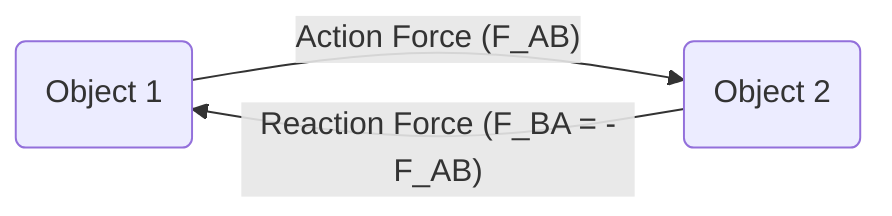

# Class 9 Science - General Chapter 108
**Language:** Hinglish

```markdown
# [Class 9] General - Chapter 108: Force and Laws of Motion (Bal aur Gati ke Niyam)

## 🌟 Core Concepts (Mukhya Avdharnayein) 📊

1.  **Force (Bal)**
    *   Push (Dhakka) / Pull (Khichav) / Hit (Thokar)
    *   Effects: Changes state of motion, velocity (speed/direction), shape/size.
2.  **Types of Forces (Bal ke Prakar)**
    *   **Balanced Forces (Santulit Bal):** Net force zero, no change in motion state. (Agar net bal zero hai, toh vastu ki gati mein koi badlav nahi hoga).
    *   **Unbalanced Forces (Asantulit Bal):** Net force non-zero, causes change in motion (acceleration). (Agar net bal zero nahi hai, toh vastu ki gati mein badlav aayega - yaani acceleration hoga).
    *   **Frictional Force (Gharshan Bal):** Opposes motion between surfaces in contact. (Gati ka virodh karne wala bal).
3.  **Inertia (Jadatva)**
    *   Resistance to change in state of rest or uniform motion. (Vastu ki apni sthiti - viramavastha ya ek saman gati - mein badlav ka virodh karne ki pravriti).
    *   **Mass (Dravyaman):** Measure of inertia. More mass = More inertia. (Jitna zyada dravyaman, utna zyada jadatva).
4.  **Newton's Laws of Motion (Newton ke Gati ke Niyam)**
    *   **First Law (Pehla Niyam - Law of Inertia):** Object remains at rest or in uniform motion unless acted upon by an unbalanced external force. (Vastu viramavastha ya saral rekha mein ek saman gati ki avastha mein bani rehti hai jab tak us par koi बाहरी asantulit bal karya na kare).
    *   **Second Law (Dusra Niyam):** Rate of change of momentum is proportional to the applied unbalanced force in the direction of the force (F ∝ Δp/Δt). Leads to **F = ma** (Force = mass × acceleration). (Kisi vastu ke samveg parivartan ki dar us par lagne wale asantulit bal ke samanupati aur bal ki disha mein hoti hai).
    *   **Third Law (Teesra Niyam):** To every action, there is an equal and opposite reaction. Forces act on *different* bodies. (Pratyek kriya ke liye, ek saman aur vipreet pratikriya hoti hai. Yeh kriya aur pratikriya bal hamesha alag-alag vastuon par lagte hain).
5.  **Momentum (Samveg - p)**
    *   Product of mass (m) and velocity (v). **p = mv**.
    *   Vector quantity (has magnitude and direction). (Ek sadish rashi hai - ismein pariman aur disha dono hote hain).
    *   SI Unit: kg m s⁻¹.

## 📘 Key Learnings (Mukhya Baatein) 📈

**1. Force (Bal): Kya Hai Aur Kya Karta Hai?**
Force ek simple sa push (dhakka) ya pull (khichav) hai. Hum ise dekh nahi sakte, par iske effects (prabhav) ko feel kar sakte hain ya dekh sakte hain.
*   **Effects:**
    *   Ek ruki hui cheez ko chala sakta hai (Moves stationary object). Example: Football ko kick karna.
    *   Chalti hui cheez ko rok sakta hai (Stops moving object). Example: Cycle ke brakes lagana.
    *   Speed badal sakta hai (Changes speed). Example: Accelerator dabana.
    *   Direction badal sakta hai (Changes direction). Example: Steering wheel ghumaana.
    *   Shape/Size badal sakta hai (Changes shape/size). Example: Spring ko kheenchna, rubber ball ko dabana.

**Diagram Concept:**
```mermaid
graph LR
    A[Force (Bal)] --> B(Change State of Motion);
    A --> C(Change Velocity - Speed/Direction);
    A --> D(Change Shape/Size);
```

**2. Balanced vs Unbalanced Forces (Santulit aur Asantulit Bal)**
*   **Balanced:** Imagine ek rassi-kheench (tug-of-war) game jisme dono teams barabar force laga rahi hain. Rassi kahin nahi jayegi. Yeh balanced forces hain. Net force = 0. Object ya toh rest par rahega ya constant velocity se chalta rahega.
*   **Unbalanced:** Agar ek team zyada zor lagaye, toh rassi us taraf move karegi. Yeh unbalanced force hai. Net force ≠ 0. Yeh force object ki motion mein change (acceleration) laata hai.
*   **Friction (Gharshan):** Hamesha motion ka oppose karta hai. Agar aap box ko halke se push karte ho, toh friction use rok sakta hai (balanced). Zyada zor se push karne par aapka force friction se zyada ho jaata hai (unbalanced) aur box move karta hai.

**3. Newton's First Law (Pehla Niyam) - The Law of Inertia (Jadatva ka Niyam)**
Koi bhi object apni current state (rest ya uniform motion) mein hi rehna chahta hai, jab tak koi bahari unbalanced force use majboor na kare. Is property ko **Inertia (Jadatva)** kehte hain.
*   **Mass and Inertia:** Bhari cheezon (more mass) ka inertia zyada hota hai. Ek pathar ko hilana ek rubber ball se mushkil hai, bhale hi size same ho. Train ka inertia cycle se bahut zyada hota hai.
*   **Examples:**
    *   Bus achanak chalti hai toh hum peeche girte hain (hamari body rest mein rehna chahti hai).
    *   Bus achanak rukti hai toh hum aage girte hain (hamari body motion mein rehna chahti hai).
    *   Carpet ko dande se peetne par dhool neeche girti hai (dhool rest mein rehna chahti hai).
    *   Ped ki tehni hilane par patte gir jaate hain (patte rest mein rehna chahte hain).

**4. Newton's Second Law (Dusra Niyam) - Force, Mass, Acceleration ka Rishta**
Yeh law batata hai ki force kitna acceleration produce karega.
*   **Momentum (p = mv):** Yeh object ke mass aur velocity ka product hai. Ek tez chalti cricket ball mein zyada momentum hota hai ek dheere chalti ball se. Ek truck mein zyada momentum hota hai ek car se (agar velocity same ho).
*   **Law Statement:** Force = Rate of change of momentum (Samveg parivartan ki dar).
*   **Formula:** **F = ma** (Force = mass × acceleration).
    *   Iska matlab hai, zyada force = zyada acceleration.
    *   Same force ke liye, zyada mass = kam acceleration.
*   **Unit of Force:** Newton (N). 1 N woh force hai jo 1 kg mass mein 1 m/s² ka acceleration produce kare.
*   **Examples:**
    *   Cricket fielder catch lete time haath peeche kheenchte hain: Isse time badh jaata hai momentum change ka (Δt increases), jisse force (F = Δp/Δt) kam lagta hai aur haath mein chot nahi lagti.
    *   High jumper cushion ya sand par girte hain: Time of impact badh jaata hai, force kam ho jaata hai.

**Diagram Concept:**
```mermaid
graph TD
    A[Force (F)] -- Proportional to --> B(Rate of Change of Momentum (Δp/Δt));
    B --> C{F = ma};
    C -- Leads to --> D[More Force -> More Acceleration];
    C -- Leads to --> E[More Mass -> Less Acceleration (for same Force)];
```

**5. Newton's Third Law (Teesra Niyam) - Action and Reaction (Kriya aur Pratikriya)**
Jab ek object dusre par force lagata hai (action), toh dusra object bhi pehle par utna hi force, lekin opposite direction mein lagata hai (reaction).
*   **Key Points:**
    *   Action and reaction forces are equal in magnitude (barabar).
    *   Opposite in direction (vipreet disha mein).
    *   Act on *different* objects (alag-alag vastuon par lagte hain). Isliye yeh ek dusre ko cancel nahi karte.
*   **Examples:**
    *   Jab hum chalte hain: Hum zameen ko peeche dhakelte hain (action), zameen humein aage dhakelti hai (reaction).
    *   Gun fire karne par: Gun bullet par aage force lagati hai (action), bullet gun par peeche force lagati hai (reaction - recoil/jhatka). Gun ka mass zyada hai, isliye uska acceleration kam hota hai.
    *   Boat se kinare par koodna: Sailor aage koodta hai (action force on boat backward), boat peeche jati hai (reaction force on sailor forward).

**Diagram Concept:**


## 🧩 Active Learning (Sakriya Adhigam)

*   **Activity: Case Study Analysis (Case Study Vishleshan) 🔍**
    *   **Research:** Research karo ki modern cars mein safety features jaise seat belts aur airbags kaise kaam karte hain. (Research how safety features like seat belts and airbags work in modern cars).
    *   **Analysis:** Analyze karo ki yeh features Newton ke kaunse laws par based hain? Inertia aur momentum change ka inmein kya role hai? Apne findings ko ek short report mein likho. (Analyze which of Newton's laws these features are based on. What role do inertia and momentum change play? Write your findings in a short report).

*   **Discussion: Real-World Impacts (Vastavik Duniya par Prabhav) 🌍**
    *   **Question 1:** Ek cricket bowler (tez gendbaaz) ball fenkne se pehle lamba run-up kyun leta hai? Newton ke laws ke basis par explain karo. (Why does a fast bowler take a long run-up before bowling? Explain based on Newton's laws).
    *   **Question 2:** Agar action aur reaction hamesha equal aur opposite hote hain, toh jab hum deewar ko dhakka dete hain, deewar move kyun nahi karti, lekin hum peeche ja sakte hain (agar skates pehne hon)? (If action and reaction are always equal and opposite, why doesn't the wall move when we push it, but we might move backward (e.g., on skates)?)
    *   **Question 3:** Bharat mein road safety ek bada issue hai. Newton ke laws ki understanding kaise better driving habits aur vehicle design mein madad kar sakti hai? (Road safety is a major issue in India. How can understanding Newton's laws help in promoting better driving habits and vehicle design?)

## 📝 Assessment Prep (Mulyankan ki Taiyari) 📝

*   **Conceptual Questions:**
    *   Inertia kya hai? Mass se kaise related hai? Daily life se 2 examples do. (What is inertia? How is it related to mass? Give 2 daily life examples).
    *   Balanced aur unbalanced forces mein kya difference hai? Diagram banakar samjhao. (What is the difference between balanced and unbalanced forces? Explain with a diagram).
    *   Newton ke teeno laws state karo aur har ek ka ek example do. (State Newton's three laws and give one example for each).
    *   Action-reaction pair hamesha different bodies par act karte hain. Is statement ka kya matlab hai? (Action-reaction pairs always act on different bodies. What does this statement mean?)
*   **Numerical Problems (Ankik Prashn):**
    *   Ek 5 kg object par 2 s ke liye constant force lagta hai. Isse object ki velocity 3 m/s se 7 m/s ho jaati hai. Applied force ka magnitude batao. Agar force 5 s ke liye lagaya jaye toh final velocity kya hogi? (Similar to Example 8.1)
    *   Ek 1000 kg car 108 km/h se chal rahi hai. Brakes lagane par 4 s mein ruk jaati hai. Brakes dwara lagaya gaya force calculate karo. (Similar to Example 8.3)
    *   Ek 10 g bullet 150 m/s se chalti hui ek wooden block se takrakar 0.03 s mein ruk jaati hai. Block dwara bullet par lagaya gaya force aur penetration distance calculate karo. (Similar to Example 13)
*   **Diagrams:** Force diagrams (simple free-body diagrams showing forces like push, friction, gravity, reaction) banane ki practice karo. Example: Ek box jo table par rakha hai, us par lagne wale forces dikhao.

## 🌏 Bharatiya Context (Bharatiya Sandarbh) 📊

1.  **Cricket:** Fielder ka catch lete time haath peeche karna (Newton's 2nd Law) ek common sight hai Bharat mein cricket matches ke dauran. Bowler ka run-up bhi momentum gain karne ke liye hota hai.
2.  **Road Safety Data:** Bharat mein road accidents ek gambhir samasya hai. Newton's laws humein samjhate hain ki high speed par sudden braking ya sharp turns kitne khatarnak ho sakte hain (due to inertia). Seat belts inertia ke effect ko kam karke injuries se bachate hain. Government of India ke transport ministry (MoRTH) ke data ko dekh kar is problem ki गंभीरता samajhi ja sakti hai.
3.  **Everyday Examples:**
    *   Cycle chalate waqt pedalling rokne par cycle friction ke karan dheemi ho jaati hai.
    *   Carrom khelte waqt striker se neeche wali goti ko hit karne par sirf wahi goti nikalti hai, baaki stack inertia ke karan wahin reh jaata hai (Activity 8.1).
    *   Bhari gas cylinder ko uthana khali cylinder se mushkil hota hai (More mass, more inertia).
4.  **Space Program (ISRO):** Rockets Newton ke third law par kaam karte hain. Rocket gases ko tezi se neeche eject karta hai (action), jiske reaction mein rocket upar jaata hai. ISRO ke successful launches is law ka behtareen pradarshan hain.

```