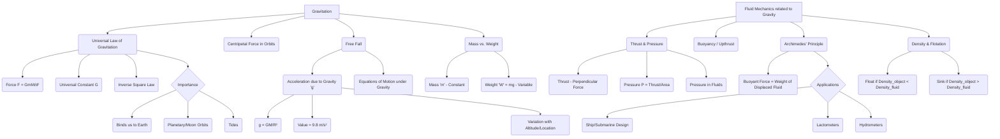

# Class 9 Science - General Chapter 109
**Language:** English

```markdown
# [Class 9] Science - Chapter 10: Gravitation

## 🌟 Core Concepts

This chapter explores the fundamental force of gravitation that governs the motion of celestial bodies and objects on Earth.

1.  **Gravitation**
    *   Definition: The universal force of attraction acting between any two objects with mass.
    *   Newton's Insight: The same force responsible for a falling apple also keeps the Moon orbiting the Earth and planets orbiting the Sun.
2.  **Universal Law of Gravitation**
    *   Statement: Every object in the universe attracts every other object with a force directly proportional to the product of their masses and inversely proportional to the square of the distance between their centres.
    *   Mathematical Expression: `F = G * (M * m) / d²`
        *   `F`: Gravitational force
        *   `G`: Universal Gravitational Constant (6.673 × 10⁻¹¹ N m² kg⁻²)
        *   `M`, `m`: Masses of the two objects
        *   `d`: Distance between the centres of the objects
    *   Characteristics:
        *   Always attractive.
        *   Acts along the line joining the centres.
        *   Universal (applies everywhere and to all objects).
        *   Weak force unless large masses are involved.
        *   Follows the inverse-square law.
3.  **Centripetal Force**
    *   Definition: The centre-seeking force required to keep an object moving in a circular path.
    *   Relation to Gravitation: Earth's gravitational pull provides the centripetal force for the Moon's orbit.
4.  **Free Fall**
    *   Definition: The motion of an object solely under the influence of Earth's gravitational force.
    *   **Acceleration Due to Gravity (g)**: The constant acceleration experienced by a freely falling object near the Earth's surface.
        *   Derivation: `g = G * M / R²` (where M is Earth's mass, R is Earth's radius)
        *   Value: Approximately 9.8 m/s² near the Earth's surface.
        *   Independence of Mass: All objects, regardless of mass, fall at the same rate in a vacuum (neglecting air resistance).
        *   Variation: `g` decreases with altitude and varies slightly on Earth's surface (greater at poles, less at the equator).
5.  **Mass vs. Weight**
    *   **Mass (m)**:
        *   Definition: Measure of inertia; amount of matter in an object.
        *   Characteristic: Constant everywhere (Earth, Moon, space).
        *   Unit: Kilogram (kg).
    *   **Weight (W)**:
        *   Definition: The gravitational force exerted by the Earth (or another celestial body) on an object.
        *   Formula: `W = m * g`
        *   Characteristic: Varies depending on the value of `g` (location).
        *   Unit: Newton (N).
        *   Direction: Acts vertically downwards.
6.  **Thrust and Pressure**
    *   **Thrust**: The force acting perpendicular to a surface. Unit: Newton (N).
    *   **Pressure (P)**: Thrust per unit area.
        *   Formula: `P = Thrust / Area`
        *   Unit: Pascal (Pa) or N/m².
        *   Principle: Same force applied over a smaller area results in higher pressure.
    *   **Pressure in Fluids**: Liquids and gases (fluids) exert pressure on the base and walls of their container due to their weight. Pressure is transmitted in all directions.
7.  **Buoyancy**
    *   Definition: The upward force exerted by a fluid on an object partially or fully immersed in it. Also called Upthrust.
    *   Effect: Makes objects feel lighter in fluids.
8.  **Archimedes' Principle**
    *   Statement: When a body is immersed fully or partially in a fluid, it experiences an upward buoyant force equal to the weight of the fluid displaced by it.
    *   Application: Explains why objects float or sink.
9.  **Density and Flotation**
    *   **Density**: Mass per unit volume (`Density = Mass / Volume`).
    *   **Principle of Flotation**:
        *   An object floats if its density is less than the fluid's density. (Buoyant Force > Weight)
        *   An object sinks if its density is greater than the fluid's density. (Weight > Buoyant Force)
        *   An object remains suspended if its density equals the fluid's density. (Buoyant Force = Weight)

📊 **Concept Hierarchy:**



## 📘 Key Learnings

1.  **Universal Law of Gravitation**: This fundamental law, formulated by Newton, describes the attractive force between any two masses.
    *   **Formula**: `F = G * (M * m) / d²`
    *   **Explanation**: The force (F) increases with larger masses (M, m) and decreases rapidly as the distance (d) between them increases (inverse-square relationship). G is a constant value throughout the universe.
    *   **Diagrammatic Representation**:
        ```
        (Object A, Mass M) <---- d ----> (Object B, Mass m)
              <---------- F ---------->
              Force on B by A   Force on A by B
              (Equal & Opposite)
        ```
    *   **Significance**: Explains phenomena like objects falling to Earth, orbits of the Moon and planets, and tides.

2.  **Free Fall and Acceleration Due to Gravity (g)**: When an object falls only under Earth's gravity (neglecting air resistance), it's in free fall.
    *   **Acceleration (g)**: It accelerates at a rate `g ≈ 9.8 m/s²` near the Earth's surface. This means its velocity increases by 9.8 m/s every second.
    *   **Formula**: `g = G * M_earth / R_earth²`
    *   **Key Point**: `g` is independent of the falling object's mass (`m`). A feather and a stone fall at the same rate in a vacuum.
    *   **Motion Equations**: Standard equations of motion apply, with `a` replaced by `g` (positive if motion is downwards, negative if upwards).
        *   `v = u + gt`
        *   `s = ut + ½ gt²`
        *   `v² = u² + 2gs`

3.  **Distinction Between Mass and Weight**:
    *   **Mass**: An intrinsic property, measuring inertia. It's constant regardless of location. Measured in kg.
    *   **Weight**: The force of gravity acting on that mass (`W = mg`). It depends on the local value of `g` and thus changes with location (e.g., Earth vs. Moon, poles vs. equator). Measured in Newtons (N).
    *   **Weight on Moon**: Since the Moon has less mass and a smaller radius than Earth, its `g` is about 1/6th of Earth's `g`. Therefore, an object's weight on the Moon is 1/6th its weight on Earth.

4.  **Thrust and Pressure**: These concepts relate force to the area over which it acts.
    *   **Thrust**: A perpendicular force (like weight acting downwards).
    *   **Pressure**: How concentrated that force is (`P = Thrust / Area`).
    *   **Practical Implications**: Sharp objects (nails, knives) exert high pressure due to small area. Wide foundations, broad tires, and wide straps distribute force over a larger area, reducing pressure.
    *   **Diagram**:
        ```
        Case 1: Small Area        Case 2: Large Area
          Force (Thrust) F          Force (Thrust) F
                |                         |
                V                         V
              -----                     -------------
              Area A1                   Area A2 (A2 > A1)
        Pressure P1 = F/A1        Pressure P2 = F/A2 (P2 < P1)
        (High Pressure)           (Low Pressure)
        ```

5.  **Buoyancy and Archimedes' Principle**: Fluids exert an upward force (buoyancy) on immersed objects.
    *   **Archimedes' Principle**: The magnitude of the buoyant force is equal to the weight of the fluid displaced by the object.
    *   **Floating/Sinking**: Determined by comparing the object's density (`ρ_object`) with the fluid's density (`ρ_fluid`).
        *   `ρ_object < ρ_fluid`: Object floats (e.g., cork, plastic bottle in water). Buoyant force > Weight.
        *   `ρ_object > ρ_fluid`: Object sinks (e.g., iron nail in water). Weight > Buoyant force.
    *   **Diagram**:
        ```
         ____________________ Fluid Surface
        |                    |
        |      Object        |
        |     /------\       |   ↑ Buoyant Force (Fb)
        |    | Weight |      |   | = Weight of displaced fluid
        |     \------/       |   ↓ Weight of Object (W)
        |        |           |
        |________|___________|

        If Fb > W --> Floats
        If W > Fb --> Sinks
        ```

## 🧩 Active Learning

1.  **Activity: Research-Based Case Study Analysis 🔍**
    *   **Topic**: India's Chandrayaan Missions (e.g., Chandrayaan-3).
    *   **Task**: Research how ISRO scientists calculated the trajectory needed to reach the Moon, considering the gravitational forces of both Earth and the Moon. Analyze the challenges of landing a rover on the Moon, where the acceleration due to gravity (`g_moon`) is approximately 1.62 m/s² (about 1/6th of Earth's `g`). How does this lower gravity affect the lander's descent speed, stability, and the rover's movement? Prepare a brief report or presentation.
    *   **Evaluation Focus**: Application of universal gravitation, calculation of gravitational forces, understanding the effect of varying 'g'.

2.  **Discussion: Critical Analysis of Real-World Impacts 🌍**
    *   **Topic 1**: The statement "Weight of gold bought at the poles will be slightly more than the weight of the same gold at the equator." Discuss why this is true (due to variation in `g`) and whether the *mass* of the gold changes. Is this difference practically significant for trade in India? (Relates to Exercise 10).
    *   **Topic 2**: Why do heavy transport trucks in India often have multiple, wide tires? Relate this to the concepts of thrust, pressure, and the condition of roads. How does this design prevent damage to roads and ensure stability?
    *   **Topic 3**: Dams in India (like Bhakra Dam or Sardar Sarovar Dam) hold back enormous amounts of water. Why are the bases of dams built much thicker than the tops? Discuss in terms of fluid pressure increasing with depth.
    *   **Bloom's Level**: Evaluating (analyzing significance, comparing scenarios), Creating (explaining phenomena using principles).

## 📝 Assessment Prep

1.  **Case Study Analysis**:
    *   A wooden block (mass 2 kg, dimensions 30cm x 20cm x 10cm) is placed on a table. Calculate the pressure exerted on the table when it rests on the face with dimensions (a) 30cm x 20cm and (b) 20cm x 10cm. (Take g = 9.8 m/s²). Explain why the pressure values are different. (Similar to Example 9.6)
    *   An object has a mass of 50 kg. What is its weight on Earth (g=9.8 m/s²) and on Mars (g=3.7 m/s²)? Explain the difference.

2.  **Diagram-Based Questions**:
    *   **(Diagram: Object falling from a height)** An object is dropped from a tower. Draw a simple velocity-time graph for its motion (assuming negligible air resistance). What does the slope of this graph represent?
    *   **(Diagram: Beaker with water, a floating cork, and a sunken nail)** Explain, using the concepts of density and buoyant force, why the cork floats and the nail sinks. Refer to Archimedes' Principle.
    *   **(Diagram: Person standing vs. lying on sand)** Explain why a person sinks deeper into loose sand when standing compared to lying down, even though the force (weight) applied is the same. Relate this to thrust and pressure.

3.  **Conceptual Questions**:
    *   State the Universal Law of Gravitation and explain the meaning of each term in the formula.
    *   Why doesn't the Earth move noticeably towards a falling apple, even though the apple attracts the Earth with an equal and opposite force? (Hint: Newton's Second and Third Laws).
    *   What is free fall? Is the acceleration during free fall dependent on the mass of the object? Explain with Galileo's Pisan experiment concept.
    *   Differentiate between mass and weight, giving units for each.
    *   State Archimedes' Principle. List two applications (e.g., designing ships, using a lactometer).

## 🌏 Bharatiya Context

1.  **Variation of 'g' and Trade**: As discussed in the Active Learning section and Exercise 10, the value of `g` is slightly greater at the poles than at the equator. While the mass of an item (like gold) remains constant, its *weight* would be slightly higher if measured at the poles compared to the equator. This difference is generally too small to impact everyday trade but is crucial in high-precision scientific measurements and standards calibration maintained by national laboratories like the National Physical Laboratory (NPL), India.
2.  **ISRO and Gravitation**: India's space agency, ISRO, heavily relies on the principles of gravitation for its missions.
    *   **Launch Site**: The Satish Dhawan Space Centre (SDSC) at Sriharikota is located relatively close to the equator. This location provides a slight velocity boost to rockets due to the Earth's rotation, helping save fuel when launching satellites into equatorial orbits – a practical application related to Earth's motion and gravity.
    *   **Missions**: Missions like Chandrayaan (Moon) and Mangalyaan (Mars) required precise calculations of gravitational forces from the Sun, Earth, Moon, and Mars to navigate spacecraft over vast distances. Understanding gravitational fields is key to achieving orbital insertion and landings.
3.  **Infrastructure and Pressure**: The concept of pressure (Force/Area) is vital in civil engineering across India.
    *   **Foundations**: Buildings, especially high-rises in cities like Mumbai or Delhi, require wide foundations to distribute the immense weight (thrust) over a larger area, reducing pressure on the soil and preventing sinking. The type of foundation depends on soil conditions, which vary greatly across India (e.g., alluvial soil in the Gangetic plains, black cotton soil in the Deccan).
    *   **Transportation**: The use of wide tires on trucks and buses, and continuous tracks on army tanks (as mentioned in the text), is essential for operating on varied Indian terrains, including softer ground or highways, minimizing pressure and damage.
    *   **Dams**: The design of large dams incorporates thicker bases to withstand the significantly higher water pressure at greater depths, ensuring structural integrity.
4.  **Density and Purity Checks**: Archimedes' Principle and density measurements are used in practical applications.
    *   **Lactometers**: Used commonly in the dairy industry in India to check the purity of milk by measuring its density (adulteration with water lowers the density).
    *   **Agriculture**: Hydrometers can be used to determine the density of solutions like fertilizers or pesticides, ensuring correct concentrations.
```