# Class 9 Science - General Chapter 110
**Language:** English

```markdown
# [Class 9] General - Chapter 110

*(Note: Based on the provided text content, this chapter corresponds to NCERT Class 9 Science Chapter 10: Work and Energy. The summary follows the structure requested for Chapter 110.)*

## 🌟 Core Concepts

```mermaid
graph TD
    A[Work, Energy & Power] --> B(Work);
    A --> C(Energy);
    A --> D(Power);

    B --> B1(Scientific Definition);
    B --> B2(Conditions for Work);
    B --> B3(Formula: W = Fs);
    B --> B4(Unit: Joule);
    B --> B5(Types: Positive, Negative, Zero Work);

    C --> C1(Definition: Capacity to do Work);
    C --> C2(Unit: Joule);
    C --> C3(Forms of Energy);
    C --> C4(Kinetic Energy);
    C --> C5(Potential Energy);
    C --> C6(Law of Conservation of Energy);
    C --> C7(Mechanical Energy);

    C3 --> C3a(Mechanical);
    C3 --> C3b(Heat);
    C3 --> C3c(Chemical);
    C3 --> C3d(Electrical);
    C3 --> C3e(Light);

    C4 --> C4a(Energy due to Motion);
    C4 --> C4b(Formula: Ek = 1/2 mv²);

    C5 --> C5a(Energy due to Position/Configuration);
    C5 --> C5b(Gravitational Potential Energy);
    C5 --> C5c(Formula: Ep = mgh);
    C5 --> C5d(Elastic Potential Energy);

    C6 --> C6a(Energy is neither created nor destroyed);
    C6 --> C6b(Energy transforms from one form to another);
    C6 --> C6c(Total energy remains constant);

    C7 --> C7a(Sum of Kinetic and Potential Energy);

    D --> D1(Definition: Rate of doing Work / Energy Transfer);
    D --> D2(Formula: P = W/t);
    D --> D3(Unit: Watt);
    D --> D4(Average Power);
    D --> D5(Commercial Unit: kWh);
```



## 📘 Key Learnings

**1. Work (Scientific Conception)**

*   **Definition:** Work is done when a force acting on an object causes displacement of the object *in the direction of the force*.
*   **Conditions for Work:**
    1.  A force must act on the object.
    2.  The object must be displaced.
    *   If either condition is not met, no scientific work is done (e.g., pushing an immovable wall, holding a heavy load stationary).
*   **Formula:** For a constant force `F` acting in the direction of displacement `s`:
    `Work Done (W) = Force (F) × Displacement (s)`
    `W = Fs`
*   **Unit:** The SI unit of work is the **Joule (J)**.
    `1 Joule = 1 Newton × 1 metre` (1 J is the work done when a force of 1 N displaces an object by 1 m along the line of action of the force).
*   **Types of Work:**
    *   **Positive Work:** Done when the force is in the same direction as the displacement (e.g., pulling a toy car).
        ```
        -----> F
        -----> s
        Work = +Fs
        ```
    *   **Negative Work:** Done when the force acts opposite to the direction of displacement (e.g., work done by friction on a moving car, work done by gravity on an object lifted upwards).
        ```
        <----- F
        -----> s
        Work = -Fs
        ```
    *   **Zero Work:** Done when:
        *   There is no displacement (s=0).
        *   The force is zero (F=0).
        *   The force is perpendicular to the displacement (e.g., work done by gravity on a satellite orbiting Earth, work done by a porter carrying a load horizontally).

**2. Energy**

*   **Definition:** The capacity or ability of an object to do work. An object possessing energy can exert a force on another object to do work.
*   **Unit:** Same as work, the **Joule (J)**. A larger unit is kiloJoule (kJ), where `1 kJ = 1000 J`.
*   **Forms of Energy:** Energy exists in various forms, including:
    *   Mechanical Energy (Kinetic + Potential)
    *   Heat Energy
    *   Chemical Energy (e.g., in food, fuels, batteries)
    *   Electrical Energy
    *   Light Energy
    *   Nuclear Energy
*   **Source:** The Sun is the primary natural source of energy for Earth. Other sources include nuclei of atoms, Earth's interior, and tides.

**3. Kinetic Energy (KE)**

*   **Definition:** The energy possessed by an object by virtue of its motion.
*   **Factors:** Depends on the mass (`m`) and velocity (`v`) of the object. Faster or more massive objects have higher KE.
*   **Formula:**
    `Kinetic Energy (Ek) = 1/2 × mass (m) × velocity (v)²`
    `Ek = 1/2 mv²`
*   **Work-Energy Theorem (for KE):** The work done on an object by a net force is equal to the change in its kinetic energy. `W = ΔEk = Ek_final - Ek_initial = 1/2 mv² - 1/2 mu²`.

**4. Potential Energy (PE)**

*   **Definition:** The energy stored in an object due to its position or configuration (shape).
*   **Types:**
    *   **Gravitational Potential Energy:** Energy stored due to an object's position (height) above a reference level (usually the ground). Work done against gravity to lift the object gets stored as PE.
        *   **Formula:** `Potential Energy (Ep) = mass (m) × acceleration due to gravity (g) × height (h)`
            `Ep = mgh`
        *   *Note:* The value of PE depends on the chosen zero level (ground). Work done by gravity depends only on the vertical difference in height, not the path taken.
    *   **Elastic Potential Energy:** Energy stored due to a change in shape or configuration (e.g., stretched rubber band, compressed spring, stretched bowstring).

**5. Law of Conservation of Energy**

*   **Statement:** Energy can neither be created nor destroyed; it can only be transformed from one form to another. The total energy of an isolated system remains constant before and after any transformation.
*   **Mechanical Energy:** The sum of kinetic energy and potential energy of an object (`Mechanical Energy = KE + PE`).
*   **Example (Free Fall):** For an object falling freely under gravity (neglecting air resistance):
    *   At the top (max height): PE is maximum (`mgh`), KE is zero (v=0). Total Energy = `mgh`.
    *   During the fall: PE decreases, KE increases (`1/2 mv²`). Total Energy = `mgh' + 1/2 mv'² = constant`.
    *   Just before hitting the ground (h=0): PE is minimum (zero), KE is maximum. Total Energy = `1/2 mv_max² = initial mgh`.
    *   `mgh + 1/2 mv² = Constant` throughout the fall.

    ```
    Free Fall Energy Conservation:
    Position      | PE      | KE      | Total E (PE+KE)
    ---------------------------------------------------
    Top (h)       | mgh (Max) | 0       | mgh
    Middle (h')   | mgh'    | 1/2mv'² | mgh (Constant)
    Bottom (h=0)  | 0 (Min) | 1/2mv²(Max)| mgh (Constant)
    ```

**6. Power**

*   **Definition:** The rate at which work is done, or the rate at which energy is transferred or consumed. It measures how fast work is done.
*   **Formula:**
    `Power (P) = Work Done (W) / Time taken (t)`
    `P = W / t`
    Also, `Power (P) = Energy Consumed / Time taken (t)`
*   **Unit:** The SI unit of power is the **Watt (W)**, named after James Watt.
    `1 Watt = 1 Joule / 1 second` (1 W = 1 J/s).
    A larger unit is kilowatt (kW), where `1 kW = 1000 W = 1000 J/s`.
*   **Average Power:** Calculated when the rate of work done is not constant.
    `Average Power = Total Work Done (or Total Energy Consumed) / Total Time Taken`
*   **Commercial Unit of Energy:** While the SI unit is Joule, electrical energy consumption is often measured in **kilowatt-hour (kWh)**, commonly called a 'unit'.
    `1 kWh = 1 kW × 1 hour = 1000 W × 3600 s = 3,600,000 J = 3.6 × 10⁶ J`.

## 🧩 Active Learning

*   **Activity: Research-based case study analysis 🔍**
    *   **Topic:** Energy Consumption in Indian Households.
    *   **Task:** Collect monthly electricity bills for your household (or a neighbour's) for 3-6 months. Note the 'units' (kWh) consumed each month. Research the power ratings (in Watts or kW) of common appliances used (lights, fans, refrigerator, TV, AC, water pump/motor). Estimate the daily/monthly energy consumption based on approximate usage hours and compare it with the bill.
    *   **Analysis:** Identify the appliances contributing most to the bill. Discuss seasonal variations (e.g., higher consumption due to AC/heaters). Research average household electricity consumption in your state/city and compare. Discuss the cost per unit of electricity.
*   **Discussion: Critical analysis of real-world impacts 🌍**
    *   **Topic:** Energy Transformation and Conservation in India.
    *   **Prompts:**
        *   Discuss the primary sources of energy used for electricity generation in India (coal, hydro, nuclear, solar, wind). What are the energy transformations involved in each?
        *   What are the environmental and economic consequences of relying heavily on fossil fuels like coal?
        *   How does the Law of Conservation of Energy apply to power generation and transmission? Where are energy losses occurring?
        *   Analyze the importance and effectiveness of government initiatives promoting renewable energy (like solar power) and energy efficiency (like BEE star ratings on appliances) in the Indian context.
        *   How can individual actions contribute to energy conservation at home, school, and in the community? Discuss practical steps.

## 📝 Assessment Prep

*   **Conceptual Questions:**
    *   Define work, energy, and power with their SI units.
    *   Under what conditions is work done (positive, negative, zero)? Give examples.
    *   State the Law of Conservation of Energy. Explain with an example like a simple pendulum or a freely falling body.
    *   Differentiate between Kinetic and Potential Energy.
    *   Why is the work done by gravity zero for a satellite orbiting the Earth?
    *   Explain why pushing a stationary wall does not constitute work in the scientific sense, even though you get tired.
*   **Numerical Problems:** Practice calculations involving:
    *   Work done: `W = Fs`
    *   Kinetic Energy: `Ek = 1/2 mv²`
    *   Potential Energy: `Ep = mgh` (use `g ≈ 9.8 m/s²` or `10 m/s²` as specified)
    *   Work-Energy Theorem: `W = ΔEk`
    *   Power: `P = W/t`
    *   Energy Consumption: Calculating energy in Joules or kWh (`Energy = Power × Time`).
*   **Diagrams:** Be prepared to interpret or draw simple diagrams illustrating:
    *   Force and displacement vectors for positive, negative, and zero work.
    *   Energy transformation in a freely falling object or a pendulum.
    *   Setup for demonstrating potential or kinetic energy (e.g., lifting an object, moving trolley).

## 🌏 Bharatiya Context

*   **Traditional Work:** Examples like a **bullock pulling a cart** or plough illustrate the scientific concept of work (force applied by the bullock causes displacement of the cart/plough). The energy for this work comes from the chemical energy stored in the bullock's food.
*   **Household Energy Consumption:** Electricity bills in India measure energy consumption in **'units'**, which correspond to **kilowatt-hours (kWh)**. Understanding this commercial unit is crucial for managing household energy use and costs (refer to Active Learning activity).
*   **National Energy Scenario:** India utilizes diverse energy sources, involving various transformations:
    *   **Thermal Power (Coal):** Chemical energy in coal -> Heat energy -> Mechanical energy (turbine) -> Electrical energy. This is a major source but has environmental implications.
    *   **Hydro Power:** Potential energy of stored water -> Kinetic energy of flowing water -> Mechanical energy (turbine) -> Electrical energy.
    *   **Renewable Sources:** Solar energy (Light energy -> Electrical energy via photovoltaic cells) and Wind energy (Kinetic energy of wind -> Mechanical energy -> Electrical energy) are increasingly important for sustainable development.
*   **Energy Efficiency:** The **Bureau of Energy Efficiency (BEE)** star rating system on appliances (refrigerators, ACs, etc.) helps consumers in India choose products that consume less electrical energy for the same amount of work, promoting energy conservation nationally.
```