# Class 9 Science - General Chapter 111
**Language:** English

```markdown
# [Class 9] Science - Chapter 11: Sound

## 🌟 Core Concepts

```mermaid
graph TD
    A[Sound] --> B(Production);
    A --> C(Propagation);
    A --> D(Characteristics);
    A --> E(Reflection);
    A --> F(Hearing);
    A --> G(Applications);

    B --> B1(Vibrating Objects);
    B1 --> B2(Examples: Tuning Fork, Vocal Cords, Musical Instruments);

    C --> C1(Requires a Medium - Solid, Liquid, Gas);
    C --> C2(Mechanical Wave);
    C --> C3(Longitudinal Wave);
    C3 --> C4(Compressions - High Pressure/Density);
    C3 --> C5(Rarefactions - Low Pressure/Density);
    C --> C6(Energy Transfer, Not Particle Transfer);

    D --> D1(Wavelength λ);
    D --> D2(Frequency ν);
    D --> D3(Time Period T);
    D --> D4(Amplitude A);
    D --> D5(Speed v);
    D --> D6(Pitch);
    D --> D7(Loudness);
    D --> D8(Quality / Timbre);
    D --> D9(Intensity);
    D2 <--> D3(ν = 1/T);
    D5 --> D10(v = λν);
    D5 --> D11(Depends on Medium & Temperature);
    D6 --> D2;
    D7 --> D4;

    E --> E1(Laws of Reflection);
    E --> E2(Echo);
    E2 --> E3(Minimum Distance: 17.2m at 22°C);
    E --> E4(Reverberation);

    F --> F1(Human Audible Range: 20 Hz - 20 kHz);
    F --> F2(Infrasound: < 20 Hz);
    F --> F3(Ultrasound: > 20 kHz);
    F --> F4(Hearing Aid);

    G --> G1(Multiple Reflection Uses);
    G1 --> G1a(Megaphones, Horns, Shehanais);
    G1 --> G1b(Stethoscope);
    G1 --> G1c(Curved Ceilings in Halls);
    G --> G2(Ultrasound Applications);
    G2 --> G2a(Cleaning);
    G2 --> G2b(Detecting Flaws in Metal);
    G2 --> G2c(Medical Imaging - Echocardiography, Ultrasonography);
    G2 --> G2d(Breaking Kidney Stones);
```



## 📘 Key Learnings

**1. Production of Sound:**
*   Sound is a form of energy that produces the sensation of hearing.
*   It is produced by **vibrating objects**. Vibration is the rapid to-and-fro motion of an object.
*   Examples:
    *   A vibrating tuning fork (Activity 11.1, 11.2; Fig 11.1, 11.2, 11.3). Touching a vibrating prong shows the vibration, and dipping it in water shows disturbances.
    *   Human voice: Vibrations of vocal cords.
    *   Musical instruments: Vibration of strings (guitar), air columns (flute, *shehanai*), membranes (drum) (Activity 11.3).
    *   Other methods: Plucking, scratching, rubbing, blowing, shaking.

**2. Propagation of Sound:**
*   Sound requires a material **medium** (solid, liquid, or gas) to travel. It cannot travel in a vacuum (like on the moon - Q4).
*   Sound travels as a **mechanical wave** because it involves the motion of particles of the medium.
*   The particles of the medium vibrate about their mean positions, transferring the disturbance (energy) to adjacent particles. The particles themselves do not travel from the source to the listener.
*   Sound waves are **longitudinal waves**: The particles of the medium vibrate back and forth *parallel* to the direction of wave propagation.
    *   This creates regions of **Compressions (C)**: High pressure and high density, where particles are crowded together.
    *   And regions of **Rarefactions (R)**: Low pressure and low density, where particles are spread apart.
    *   A series of compressions and rarefactions propagates through the medium (Fig 11.4). This can be visualized using a slinky (Activity 11.4, Fig 11.5).
*   Propagation can be visualized as density or pressure variations (Fig 11.6).

**3. Characteristics of a Sound Wave:**
*   **Wavelength (λ):** The distance between two consecutive compressions (C) or two consecutive rarefactions (R). SI unit: metre (m). (Fig 11.6c)
*   **Frequency (ν):** The number of complete oscillations (or compressions/rarefactions passing a point) per unit time. SI unit: hertz (Hz). Named after Heinrich Rudolph Hertz.
*   **Time Period (T):** The time taken for one complete oscillation, or the time taken for two consecutive compressions or rarefactions to cross a fixed point. SI unit: second (s). Relationship: **ν = 1/T**.
*   **Amplitude (A):** The magnitude of the maximum disturbance (displacement, density, or pressure change) in the medium on either side of the mean value. (Fig 11.6c). Unit depends on the quantity measured (e.g., pressure units like Pascal, or density units).
*   **Speed (v):** The distance travelled by a point on the wave (like a compression) per unit time. SI unit: metres per second (m/s).
    *   Relationship: **Speed = Wavelength × Frequency (v = λν)**.
    *   Speed depends on the properties (nature, temperature) of the medium. Generally, speed is fastest in solids, then liquids, then gases (Table 11.1). Speed increases with temperature (e.g., in air, 331 m/s at 0°C, 344 m/s at 22°C).
*   **Pitch:** The brain's interpretation of frequency. Higher frequency means higher pitch (shriller sound). Lower frequency means lower pitch (graver sound). (Fig 11.7). Example: A guitar generally produces a higher pitch than a car horn (Q2).
*   **Loudness:** Determined primarily by the **amplitude** of the sound wave. Larger amplitude means louder sound (more energy). Smaller amplitude means softer sound. (Fig 11.8). Loudness is the physiological response of the ear.
*   **Intensity:** The amount of sound energy passing each second through a unit area. Related to loudness but not the same; loudness depends on ear sensitivity.
*   **Quality (Timbre):** The characteristic that distinguishes between two sounds of the same pitch and loudness (e.g., a violin and a flute). It depends on the mixture of frequencies present.
    *   **Tone:** Sound of a single frequency.
    *   **Note:** Sound produced by a mixture of several frequencies (pleasant).
    *   **Noise:** Unpleasant sound.

**4. Reflection of Sound:**
*   Sound bounces off surfaces (solid or liquid) similar to light.
*   **Laws of Reflection:**
    1.  The angle of incidence equals the angle of reflection.
    2.  The incident wave, the reflected wave, and the normal to the surface at the point of incidence all lie in the same plane. (Activity 11.5, Fig 11.9).
*   **Echo:** The repetition of sound heard after reflection from a distant object (e.g., cliff, building).
    *   To hear a distinct echo, the time interval between the original sound and the reflected sound must be at least **0.1 s** (persistence of hearing).
    *   Minimum distance to the reflector = (Speed of sound × 0.1 s) / 2. At 22°C (v ≈ 344 m/s), this is approximately **17.2 m**.
    *   Echoes might be heard later on a hotter day because the speed of sound increases with temperature, covering the distance faster, but the minimum time gap (0.1s) required remains the same. If the time taken becomes less than 0.1s due to increased speed over a fixed distance, a distinct echo might not be heard. (Exercise Q10).
*   **Reverberation:** The persistence of sound in a large hall due to repeated reflections from walls, ceiling, and floor.
    *   Excessive reverberation is undesirable as it makes sound unclear.
    *   Reduced by using sound-absorbent materials (compressed fibreboard, rough plaster, draperies, specific seat materials).

**5. Range of Hearing:**
*   **Audible Range (Humans):** Approximately **20 Hz to 20,000 Hz (20 kHz)**. This range may decrease with age.
*   **Infrasound:** Frequencies **below 20 Hz**. Produced by rhinoceroses, whales, elephants, earthquakes, vibrating pendulums.
*   **Ultrasound:** Frequencies **above 20 kHz**. Produced by dolphins, bats, porpoises. Moths can detect bat ultrasound. Rats use it.

**6. Applications of Sound:**
*   **Uses of Multiple Reflection:**
    *   **Megaphones, loudhailers, horns, trumpets, *shehanais*:** Designed to direct sound in a particular direction using reflection (Fig 11.10).
    *   **Stethoscope:** Transmits sounds from within the body (heart, lungs) to the doctor's ears via multiple reflections in the tubes (Fig 11.11).
    *   **Concert Halls/Auditoriums:** Curved ceilings and soundboards are used to spread sound evenly after reflection (Fig 11.12, 11.13).
*   **Applications of Ultrasound:** High-frequency waves that travel along well-defined paths.
    *   **Cleaning:** Used to clean hard-to-reach parts (spiral tubes, electronic components) by detaching dirt particles in a cleaning solution using high-frequency vibrations.
    *   **Detecting Flaws:** Detecting cracks or defects in metal blocks (used in construction, bridges, machines). Ultrasound reflects back from defects (Fig 11.14).
    *   **Medical Imaging:**
        *   **Echocardiography:** Imaging the heart.
        *   **Ultrasonography (Ultrasound Scanner):** Imaging internal organs (liver, gall bladder, uterus, kidney) to detect stones, tumours, or monitor foetal development during pregnancy. Works by reflecting waves from regions with changes in tissue density.
    *   **Breaking Kidney Stones:** High-intensity ultrasound breaks small kidney stones into fine grains that can be flushed out with urine.
*   **Hearing Aid:** Electronic device for people with hearing loss. It receives sound (microphone), converts it to electrical signals, amplifies them (amplifier), converts back to sound (speaker), and sends it to the ear.

## 🧩 Active Learning

*   **Activity: Research-based Case Study Analysis 🔍**
    *   Select two different Indian musical instruments (e.g., Sitar, Tabla, Flute, Nadaswaram). Research which part of each instrument vibrates to produce sound. Compare how their construction might influence the quality (timbre) and loudness of the sound produced. Present your findings. (Based on Activity 11.3)
*   **Discussion: Critical Analysis of Real-world Impacts 🌍**
    *   Discuss the importance of acoustics in designing public spaces like classrooms, auditoriums, or railway stations in India. How does reverberation affect clarity of speech or music? What measures are commonly taken (or should be taken) in such spaces to manage sound effectively?
    *   Consider the sources of noise pollution in your locality (traffic, construction, loudspeakers). How does the concept of loudness relate to noise pollution? Evaluate the potential health impacts and discuss possible community-level solutions.

## 📝 Assessment Prep

*   **Case Studies & Diagrams 📝**
    *   **Case Study 1 (Echo Calculation):** A person stands between two parallel cliffs and claps. They hear the first echo after 1 s and the second echo after 1.5 s. If the speed of sound in air is 340 m/s, calculate the distance between the cliffs. (Evaluate understanding of echo and speed-distance-time relationship).
    *   **Case Study 2 (Ultrasound Application):** Explain, using a simple diagram similar to Fig 11.14, how ultrasound is used to check for internal cracks in a large metal beam intended for a bridge construction project. Why is ordinary sound not suitable for this? (Evaluate understanding of ultrasound properties and application).
    *   **Diagram Analysis:** Be prepared to interpret diagrams showing:
        *   Compressions and Rarefactions (like Fig 11.4).
        *   Graphical representation of a sound wave, identifying wavelength and amplitude (like Fig 11.6c).
        *   Reflection of sound in devices like megaphones or stethoscopes (like Fig 11.10, 11.11).
        *   Curved ceilings in halls (like Fig 11.12).

## 🌏 Bharatiya Context

*   **Traditional Instruments:** India has a rich heritage of musical instruments like the *Sitar*, *Veena*, *Tabla*, *Flute*, *Shehanai*, and *Nadaswaram*. Understanding how vibrations in strings, membranes, or air columns produce unique sounds (timbre, pitch) connects physics concepts to cultural heritage. The design of instruments like the *Shehanai* utilizes principles of sound reflection to direct sound effectively.
*   **Healthcare Applications:** Ultrasonography is widely used in healthcare across India for prenatal check-ups (monitoring foetal health, mandated under the PCPNDT Act to prevent sex determination), diagnosing conditions like gallstones and kidney stones, and guiding certain medical procedures. The use of ultrasound to break kidney stones is a common non-invasive treatment available in many Indian hospitals.
*   **Industrial & Infrastructure Use:** Non-Destructive Testing (NDT) using ultrasound is crucial in India's growing manufacturing and infrastructure sectors. It ensures the quality and safety of materials used in constructing buildings, bridges (like the many large river bridges), pipelines, and in the automotive and aerospace industries. This contributes to structural integrity and public safety.
*   **Noise Pollution Data:** Urban centres in India often face significant noise pollution challenges. Data from organizations like the Central Pollution Control Board (CPCB) monitors noise levels in major cities. Understanding the concepts of loudness (amplitude) and intensity helps in evaluating the impact of noise pollution (e.g., from traffic, festivals, construction) on public health and the environment in the Indian context. Regulations like the Noise Pollution (Regulation and Control) Rules, 2000, aim to manage this issue.
```