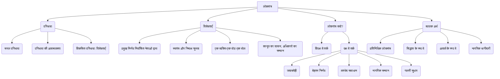

# Class 9 Social Studies - Civics Chapter 401
**Language:** हिंदी

```markdown
# [कक्षा 9] नागरिक शास्त्र - अध्याय 1: लोकतंत्र क्या? लोकतंत्र क्यों?

## 🌟 मुख्य अवधारणाएँ (Core Concepts)

लोकतंत्र की अवधारणा को समझना:
1.  **लोकतंत्र की परिभाषा:**
    *   सरल परिभाषा: लोगों द्वारा शासकों का चुनाव।
    *   परिभाषा की आवश्यकता: क्यों स्पष्ट परिभाषा जरूरी है? (विभिन्न शासन प्रणालियों में अंतर करने के लिए)।
    *   शब्दों का विकसित होता अर्थ (जैसे 'डेमोक्रेसी' का यूनानी मूल)।
2.  **लोकतंत्र की विशेषताएँ (Features of Democracy):**
    *   प्रमुख निर्णय निर्वाचित नेताओं द्वारा।
    *   स्वतंत्र और निष्पक्ष चुनावी मुकाबला।
    *   एक व्यक्ति-एक वोट-एक मोल (सार्वभौमिक वयस्क मताधिकार और राजनीतिक समानता)।
    *   कानून का शासन और अधिकारों का आदर (संवैधानिक सीमाएँ और नागरिक अधिकार)।
3.  **लोकतंत्र क्यों? (Why Democracy?):**
    *   **लोकतंत्र के खिलाफ तर्क:** अस्थिरता, नैतिकता की कमी, फैसलों में देरी, खराब फैसले, भ्रष्टाचार, सामान्य लोगों की अज्ञानता।
    *   **लोकतंत्र के पक्ष में तर्क:**
        *   अधिक जवाबदेह शासन (लोगों की जरूरतों के प्रति)।
        *   बेहतर निर्णय लेने की संभावना (परामर्श और चर्चा)।
        *   मतभेदों और टकरावों को संभालने का तरीका प्रदान करना (विविधता में एकता)।
        *   नागरिकों का सम्मान बढ़ाना (राजनीतिक समानता)।
        *   गलतियों को सुधारने का अवसर देना।
4.  **लोकतंत्र का व्यापक अर्थ (Broader Meanings):**
    *   न्यूनतम बनाम अच्छा लोकतंत्र।
    *   प्रतिनिधिक लोकतंत्र (Representative Democracy) की आवश्यकता।
    *   लोकतंत्र एक सिद्धांत के रूप में (परिवार, संगठन आदि में)।
    *   लोकतंत्र एक आदर्श के रूप में।
    *   नागरिकों की सक्रिय भागीदारी का महत्व।

**📊 अवधारणा पदानुक्रम (Concept Hierarchy):**



## 📘 मुख्य सीख (Key Learnings)

1.  **लोकतंत्र की परिभाषा और आवश्यकता:**
    *   लोकतंत्र सरकार का एक रूप है जिसमें **शासकों का चुनाव लोग करते हैं**। यह एक शुरुआती बिंदु है।
    *   हमें स्पष्ट परिभाषा की आवश्यकता इसलिए है क्योंकि कई सरकारें खुद को लोकतांत्रिक कहती हैं, भले ही वे न हों। हमें असली लोकतंत्र और दिखावटी लोकतंत्र में अंतर करने की आवश्यकता है।
    *   अब्राहम लिंकन की प्रसिद्ध परिभाषा: "लोगों की, लोगों के लिए और लोगों द्वारा चलने वाली शासन व्यवस्था"।

2.  **लोकतंत्र की मुख्य विशेषताएँ:**
    *   **प्रमुख फैसले निर्वाचित नेताओं के हाथ में:** अंतिम निर्णय लेने की शक्ति लोगों द्वारा चुने हुए प्रतिनिधियों के पास होनी चाहिए।
        *   *उदाहरण:* पाकिस्तान में जनरल मुशर्रफ के शासन में निर्वाचित प्रतिनिधियों के पास अंतिम शक्ति नहीं थी, वह सेना और जनरल मुशर्रफ के पास थी। यह अलोकतांत्रिक था।
    *   **स्वतंत्र और निष्पक्ष चुनावी मुकाबला:** लोकतंत्र निष्पक्ष और स्वतंत्र चुनावों पर आधारित होना चाहिए ताकि सत्ता में बैठे लोगों के लिए हार-जीत की समान संभावना हो।
        *   *उदाहरण:* चीन में चुनाव विकल्प नहीं देते (कम्युनिस्ट पार्टी का वर्चस्व)। मेक्सिको में PRI पार्टी धांधली से जीतती थी (2000 तक)। ये निष्पक्ष चुनाव नहीं थे।
    *   **एक व्यक्ति, एक वोट, एक मोल:** लोकतंत्र में हर वयस्क नागरिक का एक वोट होना चाहिए और हर वोट का मूल्य समान होना चाहिए।
        *   *उदाहरण:* सऊदी अरब में महिलाओं को वोट का अधिकार न होना (2015 तक), एस्टोनिया में रूसी अल्पसंख्यकों को कठिनाई, फिजी में मूल निवासी के वोट का मूल्य भारतीय मूल के नागरिक से ज्यादा होना - ये समानता के सिद्धांत के खिलाफ हैं।
    *   **कानून का शासन और अधिकारों का आदर:** एक लोकतांत्रिक सरकार संवैधानिक कानूनों और नागरिक अधिकारों द्वारा खींची गई सीमाओं के भीतर ही काम करती है।
        *   *उदाहरण:* जिम्बाब्वे में रॉबर्ट मुगाबे की सरकार ने चुनाव जीतने के बावजूद संविधान बदला, विपक्ष को दबाया, और नागरिक अधिकारों का हनन किया। यह दर्शाता है कि लोकप्रिय होना ही काफी नहीं है, कानून का शासन और अधिकारों का सम्मान भी जरूरी है।

    **📈 लोकतंत्र की विशेषताओं का सारांश:**
    लोकतंत्र शासन का एक रूप है जिसमें:
    *   लोगों द्वारा चुने गए शासक ही सारे प्रमुख फैसले करते हैं।
    *   चुनाव लोगों के लिए निष्पक्ष अवसर और विकल्प प्रदान करते हैं ताकि वे मौजूदा शासकों को बदल सकें।
    *   यह विकल्प और अवसर सभी लोगों को समान रूप से उपलब्ध हो।
    *   इस चुनाव से बनी सरकार संविधान द्वारा तय बुनियादी कानूनों और नागरिक अधिकारों के दायरे में रहकर काम करती है।

3.  **लोकतंत्र क्यों बेहतर है? (तर्क):**
    *   **जवाबदेही:** लोकतांत्रिक सरकारें लोगों की जरूरतों के प्रति अधिक जवाबदेह होती हैं क्योंकि उन्हें चुनावों का सामना करना पड़ता है।
        *   *उदाहरण:* भारत की लोकतांत्रिक व्यवस्था ने 1958-61 के अकाल के दौरान चीन की गैर-लोकतांत्रिक सरकार की तुलना में बेहतर ढंग से खाद्य संकट का सामना किया। स्वतंत्र मीडिया और विपक्षी दल सरकार पर दबाव बना सकते हैं।
    *   **बेहतर निर्णय:** लोकतंत्र में व्यापक चर्चा और परामर्श से फैसले लिए जाते हैं, जिससे गलतियों की संभावना कम होती है। इसमें समय लग सकता है, लेकिन महत्वपूर्ण फैसलों पर समय लेना बेहतर है।
    *   **मतभेदों का समाधान:** लोकतंत्र मतभेदों और टकरावों को शांतिपूर्ण ढंग से सुलझाने का तरीका प्रदान करता है। भारत जैसे अत्यधिक सामाजिक विविधता वाले देश में लोकतंत्र एकता बनाए रखने में मदद करता है।
    *   **नागरिकों की गरिमा:** लोकतंत्र राजनीतिक समानता के सिद्धांत पर आधारित है। यह नागरिकों को शासक का दर्जा देता है, प्रजा का नहीं, जिससे उनकी गरिमा बढ़ती है।
    *   **गलतियों का सुधार:** लोकतंत्र में गलतियों को लंबे समय तक छुपाया नहीं जा सकता। सार्वजनिक बहस और सुधार की गुंजाइश होती है। शासकों को या तो अपने फैसले बदलने पड़ते हैं या लोग शासकों को बदल सकते हैं।

4.  **लोकतंत्र के खिलाफ तर्क:**
    *   नेता बदलते रहते हैं, जिससे अस्थिरता आती है।
    *   राजनीतिक लड़ाई और सत्ता का खेल होता है, नैतिकता की जगह नहीं होती।
    *   बहुत लोगों से बहस करनी पड़ती है, जिससे फैसलों में देरी होती है।
    *   चुने हुए नेताओं को लोगों के हितों का पता नहीं होता, जिससे खराब फैसले होते हैं।
    *   चुनावी लड़ाई पर आधारित होने के कारण भ्रष्टाचार होता है।
    *   सामान्य लोगों को पता नहीं होता कि उनके लिए क्या अच्छा है, इसलिए उन्हें फैसले नहीं लेने चाहिए।
    *   *महत्वपूर्ण:* लोकतंत्र सभी समस्याओं का जादुई हल नहीं है, लेकिन उपलब्ध विकल्पों में यह बेहतर है।

5.  **लोकतंत्र का व्यापक अर्थ:**
    *   **प्रतिनिधिक लोकतंत्र:** आज के समय में लोकतंत्र का सबसे आम रूप है, जहाँ लोग अपने प्रतिनिधियों के माध्यम से शासन करते हैं। यह बड़े समाजों के लिए आवश्यक है।
    *   **न्यूनतम बनाम अच्छा लोकतंत्र:** परिभाषा की विशेषताएँ न्यूनतम शर्तें हैं। एक अच्छा लोकतंत्र इन आदर्शों को प्राप्त करने का निरंतर प्रयास करता है।
    *   **लोकतंत्र एक सिद्धांत:** इसे सरकार के अलावा जीवन के अन्य क्षेत्रों (परिवार, कक्षा, संगठन) में भी लागू किया जा सकता है, जहाँ निर्णय लेने में सबकी सहमति और भागीदारी हो।
    *   **नागरिकों की भूमिका:** लोकतंत्र की सफलता केवल शासकों पर नहीं, बल्कि नागरिकों की सक्रिय भागीदारी पर निर्भर करती है।

## 🧩 सक्रिय शिक्षण (Active Learning)

*   **गतिविधि: शोध-आधारित केस स्टडी विश्लेषण 🔍**
    *   पाठ में उल्लिखित किसी एक देश (जैसे पाकिस्तान, चीन, मेक्सिको, जिम्बाब्वे, म्यांमार) या भारत के किसी पड़ोसी देश की हालिया राजनीतिक घटनाओं पर शोध करें।
    *   लोकतंत्र की चार प्रमुख विशेषताओं (प्रमुख निर्णय, स्वतंत्र चुनाव, एक व्यक्ति-एक वोट-एक मोल, कानून का शासन और अधिकार) के आधार पर विश्लेषण करें कि वह देश कितना लोकतांत्रिक है। अपने निष्कर्ष कक्षा में प्रस्तुत करें।
*   **चर्चा: वास्तविक दुनिया के प्रभावों का आलोचनात्मक विश्लेषण 🌍**
    *   कक्षा में "लोकतंत्र क्यों?" विषय पर वाद-विवाद आयोजित करें।
    *   विद्यार्थी लोकतंत्र के पक्ष और विपक्ष में दिए गए तर्कों पर विचार करें।
    *   भारत और दुनिया के अन्य देशों से वास्तविक उदाहरणों का उपयोग करके इन तर्कों का समर्थन या खंडन करें। चर्चा करें कि क्या लोकतंत्र भारत जैसे विविधतापूर्ण देश के लिए सबसे उपयुक्त प्रणाली है और क्यों?

## 📝 मूल्यांकन तैयारी (Assessment Prep)

*   **केस स्टडीज:**
    *   *स्थिति 1:* एक देश में नियमित चुनाव होते हैं, लेकिन सेना प्रमुख की सहमति के बिना सेना के बारे में कोई कानून पारित नहीं किया जा सकता। क्या यह देश लोकतांत्रिक है? क्यों? (संकेत: प्रमुख निर्णय निर्वाचित नेताओं द्वारा?)
    *   *स्थिति 2:* एक देश में चुनाव जीतने वाली पार्टी पिछले 20 वर्षों से सत्ता में है। विपक्षी दल चुनाव लड़ते हैं लेकिन कभी जीत नहीं पाते क्योंकि सरकारी मशीनरी का दुरुपयोग होता है। क्या यह चुनाव प्रक्रिया लोकतांत्रिक है? क्यों? (संकेत: स्वतंत्र और निष्पक्ष चुनाव?)
    *   *स्थिति 3:* एक देश में सभी नागरिकों को वोट देने का अधिकार है, लेकिन एक प्रमुख धार्मिक समूह के लोगों को सरकारी नीतियों की आलोचना करने पर गिरफ्तार कर लिया जाता है। क्या यह देश पूरी तरह लोकतांत्रिक है? क्यों? (संकेत: कानून का शासन और अधिकारों का सम्मान?)
*   **आरेख/फ़्लोचार्ट आधारित प्रश्न:**
    *   लोकतंत्र की परिभाषा के विकास को दर्शाने वाला एक फ़्लोचार्ट बनाएं (सरल परिभाषा -> प्रश्न -> विशेषताएँ -> सारांश परिभाषा)।
    *   लोकतंत्र के पक्ष और विपक्ष में तर्कों को सूचीबद्ध करने वाली एक तालिका बनाएं।

## 🌏 भारतीय संदर्भ (Bharatiya Context)

*   **विविधता में एकता:** भारत एक अत्यधिक सामाजिक, भाषाई और धार्मिक विविधता वाला देश है। लोकतंत्र विभिन्न समूहों को शांतिपूर्वक एक साथ रहने और मतभेदों को सुलझाने का एक मंच प्रदान करके देश को एकजुट रखने में मदद करता है (लोकतंत्र के पक्ष में एक तर्क)।
*   **अकाल और जवाबदेही:** 1958-61 में चीन के विनाशकारी अकाल की तुलना में भारत में लोकतंत्र (विपक्षी दल, स्वतंत्र प्रेस) ने सरकार को खाद्य सुरक्षा के प्रति अधिक जवाबदेह बनाया, जिससे उस पैमाने का अकाल यहाँ नहीं पड़ा।
*   **गरीबी और लोकतंत्र:** कक्षा की बहस में यह मुद्दा उठता है कि दशकों के लोकतंत्र के बावजूद भारत में गरीबी क्यों है। यह दर्शाता है कि लोकतंत्र समस्याओं का स्वतः समाधान नहीं है, लेकिन यह नागरिकों को अपनी आवाज उठाने और सुधार की मांग करने का अधिकार देता है।
*   **न्यायपालिका की भूमिका:** भारतीय सर्वोच्च न्यायालय द्वारा बिहार विधानसभा भंग करने को असंवैधानिक ठहराना (जैसा कि 'Check Your Progress' में उल्लेखित है) कानून के शासन और संवैधानिक सीमाओं के महत्व को दर्शाता है।
*   **ग्राम सभा:** स्थानीय स्तर पर प्रत्यक्ष लोकतंत्र का एक उदाहरण, जहाँ गाँव के सभी वयस्क मतदाता एक साथ बैठकर निर्णय ले सकते हैं (हालांकि व्यवहार में इसकी बैठकें नियमित न होना एक चुनौती है)।
*   **चुनाव और राजनीति:** भारत में नियमित चुनाव, बहुदलीय प्रणाली, और राजनीतिक प्रतिस्पर्धा लोकतंत्र की कार्यप्रणाली के महत्वपूर्ण पहलू हैं, यद्यपि इसमें सुधार की गुंजाइश हमेशा बनी रहती है।
```