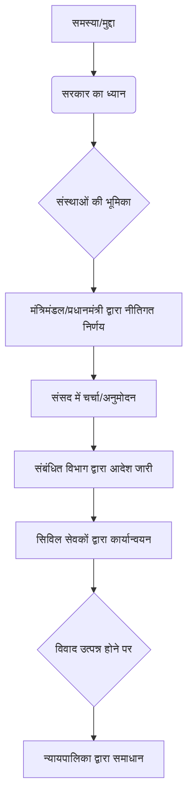

# Class 9 Social Studies - Civics Chapter 404
**Language:** हिंदी

```markdown
# [कक्षा 9] नागरिक शास्त्र - अध्याय 4: संस्थाओं का कामकाज

## 🌟 मुख्य अवधारणाएँ (Core Concepts)

यह अध्याय लोकतंत्र में संस्थाओं के कामकाज पर केंद्रित है। लोकतंत्र का अर्थ केवल शासकों का चुनाव करना नहीं है, बल्कि यह भी है कि शासक नियमों और प्रक्रियाओं का पालन करें तथा संस्थाओं के भीतर काम करें।

**प्रमुख संस्थाएँ और उनकी भूमिका:**

1.  **विधायिका (Legislature - संसद):**
    *   कानून बनाना।
    *   सरकार पर नियंत्रण रखना।
    *   बजट पारित करना और वित्त पर नियंत्रण।
    *   सार्वजनिक मुद्दों पर बहस का सर्वोच्च मंच।
2.  **कार्यपालिका (Executive):**
    *   **राजनीतिक कार्यपालिका (Political Executive):** निर्वाचित नेता (प्रधानमंत्री, मंत्री) जो प्रमुख नीतिगत निर्णय लेते हैं।
    *   **स्थायी कार्यपालिका (Permanent Executive - सिविल सेवक/नौकरशाह):** नियुक्त अधिकारी जो निर्णयों को लागू करते हैं और प्रशासन में सहायता करते हैं।
    *   सरकार की नीतियों को लागू करना।
    *   रोजमर्रा का प्रशासन चलाना।
3.  **न्यायपालिका (Judiciary):**
    *   नागरिकों, सरकार और राज्यों के बीच विवादों का निपटारा करना।
    *   संविधान की व्याख्या करना।
    *   मौलिक अधिकारों की रक्षा करना।
    *   कानूनों और सरकारी कार्रवाइयों की संवैधानिक वैधता की जाँच करना (न्यायिक समीक्षा)।

**निर्णय लेने की प्रक्रिया का पदानुक्रम 📊:**



## 📘 मुख्य सीख (Key Learnings)

**1. प्रमुख नीतिगत निर्णय कैसे लिया जाता है? (उदाहरण: मंडल आयोग)** 📈

*   **सरकारी आदेश (Office Memorandum):** 13 अगस्त 1990 को भारत सरकार ने एक आदेश (O.M. No. 36012/31/90) जारी किया।
*   **निर्णय:** सरकारी नौकरियों में सामाजिक और शैक्षिक रूप से पिछड़े वर्गों (SEBC) के लिए 27% आरक्षण लागू करना। यह अनुसूचित जाति (SC) और अनुसूचित जनजाति (ST) के आरक्षण के अतिरिक्त था।
*   **निर्णय निर्माता (Decision Makers):**
    *   **मंडल आयोग (Mandal Commission):** 1979 में गठित, 1980 में रिपोर्ट सौंपी, जिसमें 27% आरक्षण की सिफारिश की गई।
    *   **संसद (Parliament):** रिपोर्ट पर वर्षों तक चर्चा हुई।
    *   **राजनीतिक दल (Political Parties):** जनता दल ने 1989 के चुनाव घोषणापत्र में इसे लागू करने का वादा किया।
    *   **प्रधानमंत्री और मंत्रिमंडल (PM and Cabinet):** वी.पी. सिंह के नेतृत्व वाली सरकार ने इसे लागू करने का औपचारिक निर्णय लिया (6 अगस्त 1990)।
    *   **राष्ट्रपति (President):** ने संसद में सरकार के इरादे की घोषणा की।
    *   **सिविल सेवक (Civil Servants):** कार्मिक और प्रशिक्षण विभाग के अधिकारियों ने आदेश का मसौदा तैयार किया और मंत्री की मंजूरी के बाद जारी किया।
*   **विवाद और समाधान:**
    *   इस निर्णय से देश भर में व्यापक विरोध और बहस हुई। कुछ ने इसे समानता के अवसर के खिलाफ माना, जबकि अन्य ने इसे पिछड़े वर्गों के प्रतिनिधित्व के लिए आवश्यक बताया।
    *   मामला **सर्वोच्च न्यायालय (Supreme Court)** में गया ('इंदिरा साहनी एवं अन्य बनाम भारत संघ' मामला)।
    *   1992 में, न्यायालय ने आरक्षण को वैध ठहराया, लेकिन सरकार को 'क्रीमी लेयर' (पिछड़े वर्गों के संपन्न तबके) को इससे बाहर रखने का निर्देश दिया।

**2. राजनीतिक संस्थाओं की आवश्यकता (Need for Political Institutions)**

*   किसी भी देश को चलाने के लिए विभिन्न कार्य (सुरक्षा, शिक्षा, स्वास्थ्य, कर संग्रह, कल्याण योजनाएं) करने होते हैं।
*   इन कार्यों के लिए निर्णय लेने, उन्हें लागू करने और विवादों को सुलझाने के लिए व्यवस्थाएँ बनाई जाती हैं, जिन्हें **संस्थाएँ (Institutions)** कहते हैं।
*   संस्थाएँ नियमों और प्रक्रियाओं पर आधारित होती हैं। इससे निर्णयों में देरी हो सकती है, लेकिन यह व्यापक विचार-विमर्श का अवसर देती हैं और खराब निर्णयों को जल्दबाजी में लेने से रोकती हैं।
*   प्रमुख संस्थाएँ: प्रधानमंत्री और मंत्रिमंडल (नीतिगत निर्णय), सिविल सेवक (कार्यान्वयन), सर्वोच्च न्यायालय (विवाद समाधान)।

**3. संसद (Parliament)**

*   भारत में राष्ट्रीय स्तर पर निर्वाचित प्रतिनिधियों की सभा को संसद कहा जाता है।
*   **संसद की आवश्यकता क्यों?**
    *   कानून बनाने वाली सर्वोच्च संस्था (विधायिका)।
    *   सरकार चलाने वालों पर नियंत्रण (विशेषकर लोकसभा का)।
    *   सरकारी वित्त पर नियंत्रण (बजट स्वीकृति)।
    *   सार्वजनिक मामलों और राष्ट्रीय नीति पर बहस का सबसे बड़ा मंच।
*   **संसद के दो सदन (Two Houses):**
    *   **लोकसभा (Lok Sabha - House of the People):** प्रत्यक्ष रूप से जनता द्वारा चुने गए सदस्य। कार्यकाल 5 वर्ष (भंग हो सकती है)। सदस्य संख्या: 543 (निर्वाचित)।
    *   **राज्यसभा (Rajya Sabha - Council of States):** अप्रत्यक्ष रूप से राज्यों की विधानसभाओं के सदस्यों द्वारा चुने गए सदस्य। स्थायी सदन (सदस्य 6 वर्ष के लिए चुने जाते हैं, एक-तिहाई सदस्य हर 2 साल में सेवानिवृत्त होते हैं)। सदस्य संख्या: 238 (निर्वाचित) + 12 (मनोनीत)।
    *   **राष्ट्रपति (President):** संसद का अभिन्न अंग हैं (किसी भी सदन के सदस्य नहीं होते हुए भी)।
*   **कौन सा सदन अधिक शक्तिशाली?**
    *   **लोकसभा:** सामान्य विधेयकों पर मतभेद होने पर संयुक्त बैठक में लोकसभा की राय प्रभावी होती है (सदस्य संख्या अधिक होने के कारण)। धन विधेयकों पर लोकसभा को अधिक शक्तियाँ प्राप्त हैं (राज्यसभा केवल 14 दिन रोक सकती है या सुझाव दे सकती है)। मंत्रिपरिषद केवल लोकसभा के प्रति उत्तरदायी होती है (अविश्वास प्रस्ताव केवल लोकसभा में लाया जा सकता है)।

**4. कार्यपालिका (Executive)**

*   **राजनीतिक कार्यपालिका (Political Executive):** जनता द्वारा एक निश्चित अवधि के लिए निर्वाचित नेता (जैसे प्रधानमंत्री, मंत्री)। ये बड़े नीतिगत निर्णय लेते हैं।
*   **स्थायी कार्यपालिका (Permanent Executive - सिविल सेवा/नौकरशाही):** लंबे समय के लिए नियुक्त अधिकारी (सिविल सेवक)। ये राजनीतिक कार्यपालिका के अधीन काम करते हैं और प्रशासन में मदद करते हैं। सत्ताधारी पार्टी बदलने पर भी ये पद पर बने रहते हैं।
*   **मंत्री बनाम सिविल सेवक:** मंत्री अधिक शक्तिशाली होते हैं क्योंकि वे जनता के प्रतिनिधि होते हैं और जनता के प्रति जवाबदेह होते हैं। वे नीति का समग्र ढाँचा और उद्देश्य तय करते हैं, भले ही उनके पास तकनीकी विशेषज्ञता कम हो। वे विशेषज्ञों की सलाह लेते हैं लेकिन अंतिम निर्णय उनका होता है।
*   **प्रधानमंत्री और मंत्रिपरिषद (Prime Minister and Council of Ministers):**
    *   **प्रधानमंत्री (PM):** सरकार का प्रमुख। राष्ट्रपति लोकसभा में बहुमत वाली पार्टी या गठबंधन के नेता को PM नियुक्त करते हैं। कार्यकाल निश्चित नहीं (लोकसभा में बहुमत रहने तक)। मंत्रियों का चयन, विभागों का बँटवारा, कैबिनेट की बैठकों की अध्यक्षता, विभिन्न मंत्रालयों में समन्वय। PM के इस्तीफे से पूरी मंत्रिपरिषद का इस्तीफा माना जाता है। गठबंधन सरकारों में PM की शक्तियाँ कुछ सीमित हो जाती हैं।
    *   **मंत्रिपरिषद (Council of Ministers):** इसमें सभी मंत्री (लगभग 60-80) शामिल होते हैं।
        *   **कैबिनेट मंत्री (Cabinet Ministers):** प्रमुख मंत्रालयों के प्रभारी (लगभग 25 मंत्री)। मंत्रिपरिषद के नाम पर निर्णय कैबिनेट की बैठकों में लिए जाते हैं। यह मंत्रिपरिषद का 'भीतरी घेरा' है।
        *   **राज्य मंत्री (स्वतंत्र प्रभार) (Ministers of State - Independent Charge):** छोटे मंत्रालयों के प्रभारी। विशेष आमंत्रण पर ही कैबिनेट बैठक में भाग लेते हैं।
        *   **राज्य मंत्री (Ministers of State):** कैबिनेट मंत्रियों की सहायता करते हैं।
    *   **सामूहिक जिम्मेदारी (Collective Responsibility):** कैबिनेट एक टीम के रूप में काम करती है। कोई भी मंत्री सरकार के किसी भी निर्णय की सार्वजनिक रूप से आलोचना नहीं कर सकता।

**5. राष्ट्रपति (President)**

*   राज्य का प्रमुख (Head of State)। प्रधानमंत्री सरकार के प्रमुख होते हैं।
*   शक्तियाँ मुख्यतः **नाममात्र (Nominal)** और **औपचारिक (Ceremonial)** होती हैं (ब्रिटेन की महारानी की तरह)।
*   **चुनाव:** अप्रत्यक्ष रूप से संसद सदस्यों (MPs) और राज्य विधानसभा सदस्यों (MLAs) द्वारा।
*   **शक्तियाँ:**
    *   सभी सरकारी गतिविधियाँ राष्ट्रपति के नाम पर होती हैं।
    *   प्रमुख नियुक्तियाँ (भारत के मुख्य न्यायाधीश, सुप्रीम कोर्ट और हाई कोर्ट के न्यायाधीश, राज्यपाल, चुनाव आयुक्त, राजदूत आदि) राष्ट्रपति के नाम पर होती हैं।
    *   सभी कानून और संधियाँ राष्ट्रपति के नाम पर बनते हैं।
    *   रक्षा बलों के सर्वोच्च कमांडर।
    *   **लेकिन:** ये सभी शक्तियाँ **मंत्रिपरिषद की सलाह पर** ही प्रयोग करते हैं। वे सलाह पर पुनर्विचार के लिए कह सकते हैं, लेकिन दोबारा वही सलाह मिलने पर मानने को बाध्य हैं।
    *   संसद द्वारा पारित विधेयक राष्ट्रपति की स्वीकृति के बाद ही कानून बनता है (वे कुछ समय के लिए रोक सकते हैं या पुनर्विचार के लिए भेज सकते हैं, लेकिन दोबारा पारित होने पर हस्ताक्षर करने होते हैं)।
    *   **विवेकाधीन शक्ति (Discretionary Power):** जब लोकसभा में किसी दल या गठबंधन को स्पष्ट बहुमत न मिले, तो प्रधानमंत्री की नियुक्ति में अपने विवेक का प्रयोग करते हैं।

**6. न्यायपालिका (Judiciary)**

*   देश की सभी अदालतों को सामूहिक रूप से न्यायपालिका कहा जाता है (सर्वोच्च न्यायालय, उच्च न्यायालय, जिला न्यायालय आदि)।
*   **एकीकृत न्यायपालिका (Integrated Judiciary):** सर्वोच्च न्यायालय देश में न्यायिक प्रशासन को नियंत्रित करता है और उसके निर्णय सभी अदालतों पर बाध्यकारी होते हैं।
*   **विवाद समाधान:** नागरिकों के बीच, नागरिक और सरकार के बीच, राज्य सरकारों के बीच, केंद्र और राज्य सरकार के बीच।
*   **स्वतंत्र न्यायपालिका (Independent Judiciary):** लोकतंत्र के लिए आवश्यक। यह विधायिका या कार्यपालिका के नियंत्रण में नहीं होती। न्यायाधीश सरकार के निर्देशों या पार्टी की इच्छा के अनुसार कार्य नहीं करते।
    *   **नियुक्ति:** राष्ट्रपति द्वारा प्रधानमंत्री और मुख्य न्यायाधीश की सलाह पर (व्यवहार में वरिष्ठ न्यायाधीशों की कॉलेजियम प्रणाली)।
    *   **पद से हटाना:** अत्यंत कठिन प्रक्रिया (महाभियोग - संसद के दोनों सदनों द्वारा दो-तिहाई बहुमत से पारित)।
*   **न्यायपालिका की शक्तियाँ:**
    *   **संविधान की व्याख्या:** संविधान के प्रावधानों का अर्थ स्पष्ट करना।
    *   **न्यायिक समीक्षा (Judicial Review):** विधायिका के किसी कानून या कार्यपालिका की किसी कार्रवाई को संविधान के विरुद्ध पाए जाने पर अवैध घोषित करना।
    *   **मौलिक अधिकारों का संरक्षण:** नागरिक अपने अधिकारों के उल्लंघन पर न्यायालय जा सकते हैं।
    *   **जनहित याचिका (Public Interest Litigation - PIL):** कोई भी व्यक्ति सार्वजनिक हित में न्यायालय जा सकता है यदि सरकारी कार्यों से उसे नुकसान हो रहा हो।
*   न्यायपालिका सरकारी शक्तियों के दुरुपयोग और अधिकारियों के भ्रष्टाचार पर रोक लगाती है, जिससे लोगों का इस पर काफी विश्वास है।

## 🧩 सक्रिय शिक्षण (Active Learning)

*   **गतिविधि (Activity):** मंडल आयोग आरक्षण आदेश के मामले का गहराई से अध्ययन करें। 🔍 पता लगाएँ कि विभिन्न सामाजिक समूहों और राजनीतिक दलों की इस पर क्या प्रतिक्रियाएँ थीं और इसके दीर्घकालिक प्रभाव क्या रहे हैं। *वैकल्पिक:* अपने राज्य सरकार द्वारा हाल ही में लिए गए किसी बड़े नीतिगत निर्णय (जैसे कोई नई योजना, कानून या परियोजना) का पता लगाएं और उसमें राज्यपाल, मंत्रिपरिषद, विधानसभा और न्यायालयों (यदि कोई विवाद हुआ हो) की भूमिका का विश्लेषण करें।
*   **चर्चा (Discussion):** कक्षा में चर्चा करें: 🌍
    *   क्या आरक्षण जैसी नीतियाँ सामाजिक न्याय सुनिश्चित करने का प्रभावी तरीका हैं? इसके पक्ष और विपक्ष में क्या तर्क हैं?
    *   गठबंधन सरकारों के दौर में प्रधानमंत्री की शक्तियों पर क्या प्रभाव पड़ता है? क्या यह लोकतंत्र के लिए अच्छा है या बुरा?
    *   क्या न्यायपालिका को कानूनों की समीक्षा करने का अधिकार होना चाहिए, या यह केवल निर्वाचित प्रतिनिधियों का काम होना चाहिए?

## 📝 मूल्यांकन तैयारी (Assessment Prep)

*   **केस स्टडी (Case Studies):**
    *   **मंडल आयोग आरक्षण आदेश:** निर्णय प्रक्रिया, शामिल संस्थाएँ, विवाद और न्यायपालिका की भूमिका को समझें।
    *   **किसी विधेयक का कानून बनना:** लोकसभा और राज्यसभा की भूमिका, राष्ट्रपति की सहमति की प्रक्रिया को समझें।
*   **रेखाचित्र/चार्ट (Diagrams/Charts):** 📝
    *   भारत की प्रमुख संस्थाओं (विधायिका, कार्यपालिका, न्यायपालिका) के बीच शक्तियों के पृथक्करण और संतुलन को दर्शाने वाला चित्र बनाएँ।
    *   लोकसभा और राज्यसभा की शक्तियों की तुलना करते हुए एक तालिका बनाएँ।
    *   प्रधानमंत्री और राष्ट्रपति की शक्तियों और भूमिकाओं की तुलना करें।

## 🌏 भारतीय संदर्भ (Bharatiya Context)

*   **राष्ट्रीय सामाजिक/आर्थिक आँकड़े 📊:**
    *   **सरकारी नौकरियों में प्रतिनिधित्व:** विभिन्न सामाजिक समूहों (SC, ST, OBC, सामान्य) का सरकारी नौकरियों में प्रतिनिधित्व के आँकड़ों का विश्लेषण करें। (स्रोत: कार्मिक और प्रशिक्षण विभाग (DoPT) रिपोर्ट)
    *   **संसदीय प्रतिनिधित्व:** लोकसभा और राज्यसभा में महिला सांसदों और विभिन्न सामाजिक पृष्ठभूमि के सांसदों के प्रतिशत का अध्ययन करें। (स्रोत: संसद वेबसाइट, PRS Legislative Research)
    *   **न्यायिक आँकड़े:** भारत के सर्वोच्च न्यायालय और उच्च न्यायालयों में लंबित मामलों की संख्या और निपटान दर पर विचार करें। (स्रोत: राष्ट्रीय न्यायिक डेटा ग्रिड (NJDG))
    *   **बजट आवंटन:** केंद्र सरकार द्वारा शिक्षा, स्वास्थ्य, रक्षा जैसे विभिन्न क्षेत्रों के लिए बजट आवंटन का विश्लेषण करें। (स्रोत: केंद्रीय बजट दस्तावेज़)

ये आँकड़े और उदाहरण दर्शाते हैं कि ये संस्थाएँ वास्तविक जीवन में कैसे काम करती हैं और उनका भारतीय समाज और अर्थव्यवस्था पर क्या प्रभाव पड़ता है।
```