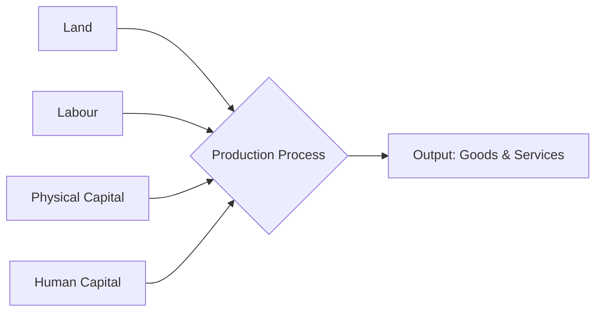

# Class 9 Social Studies - Economics Chapter 201
**Language:** English

```markdown
# [Class 9] Economics - Chapter 1: The Story of Village Palampur

## 🌟 Core Concepts

This chapter introduces fundamental economic concepts related to production through the narrative of a hypothetical Indian village, Palampur.

**📊 Concept Hierarchy:**

1.  **Production:** The aim is to produce goods and services.
    *   **Organisation of Production:** Requires combining factors of production.
    *   **Factors of Production:**
        *   **Land:** Natural resources (soil, water, forests, minerals). Fixed in supply.
        *   **Labour:** Human effort (manual or skilled). Abundant in Palampur.
        *   **Physical Capital:** Man-made inputs.
            *   **Fixed Capital:** Used over many years (Tools, Machines, Buildings - e.g., plough, tractor, tubewell, computer).
            *   **Working Capital:** Used up in production (Raw Materials, Money in Hand - e.g., seeds, yarn, clay, cash for payments).
        *   **Human Capital:** Knowledge and enterprise to combine other factors (Introduced, detailed in the next chapter).
2.  **Activities in Palampur:**
    *   **Farming Activities (Main):** ~75% of the working population dependent.
        *   **Land Constraint:** Cultivable land area is fixed (no expansion since 1960).
        *   **Increasing Production from Fixed Land:**
            *   **Multiple Cropping:** Growing more than one crop per year on the same land (e.g., Kharif - Jowar/Bajra; Potato; Rabi - Wheat; Sugarcane). Enabled by irrigation.
            *   **Modern Farming Methods:** Using High Yielding Variety (HYV) seeds, chemical fertilizers, pesticides, assured irrigation (tubewells), and machinery (tractors, threshers). Led to the Green Revolution.
        *   **Irrigation:** Well-developed in Palampur (electricity-run tubewells). Uneven across India.
        *   **Land Distribution:** Unequal (150 landless families, 240 small farmers <2ha, 60 medium/large farmers >2ha).
        *   **Labour:** Small farmers use family labour; medium/large farmers hire landless labourers (often paid below minimum wage due to competition).
        *   **Capital:** Modern methods require significant capital. Small farmers borrow at high interest (e.g., Savita); large farmers use savings from surplus (e.g., Tejpal Singh).
        *   **Sustainability Issues:** Overuse of chemical fertilizers (loss of soil fertility), groundwater depletion from tubewells.
        *   **Sale of Surplus:** Small farmers consume most produce; medium/large farmers sell surplus in markets (e.g., Raiganj), generating savings for reinvestment.
    *   **Non-Farm Activities (Limited Scale):** ~25% of the working population.
        *   **Dairy:** Common activity; milk sold locally or transported to chilling centres.
        *   **Small-Scale Manufacturing:** Simple production, often home-based (e.g., Mishrilal's jaggery production).
        *   **Shopkeeping:** Trading goods bought from wholesale markets (general stores, eatables).
        *   **Transport:** Ferrying goods and people (rickshaws, tongas, jeeps, tractors, bullock carts - e.g., Kishora).

## 📘 Key Learnings

**1. Factors of Production:**
Production of any good or service requires the combination of four essential factors:
*   **Land:** Includes all natural resources. Its supply is fixed, posing a constraint on agricultural expansion.
*   **Labour:** The human workforce. In Palampur, labour is abundant, especially unskilled farm labour, leading to low wages.
*   **Physical Capital:** Consists of:
    *   *Fixed Capital:* Durable assets like machines (tractors, tubewells) and buildings used repeatedly.
    *   *Working Capital:* Inputs used up during production, like seeds, fertilizers, and cash required for transactions.
*   **Human Capital:** The knowledge, skill, and enterprise needed to organize production (briefly mentioned).

**Diagrammatic Representation (Conceptual Flow):**


**2. Farming Methods in Palampur:**
Farmers in Palampur utilize two main strategies to increase production from their fixed land:
*   **Multiple Cropping:** Growing different crops in different seasons on the same land (e.g., Kharif, Rabi, plus potato/sugarcane). This is possible due to well-developed irrigation.
*   **Modern Farming Methods (Green Revolution):** Using HYV seeds, chemical inputs, irrigation, and machinery. This significantly increased yields (e.g., wheat yield rose from 1300 kg/ha to 3200 kg/ha) but requires more capital and raises environmental concerns.

**📈 Comparison: Traditional vs. Modern Farming**

| Feature           | Traditional Farming                     | Modern Farming (Green Revolution)              |
| :---------------- | :-------------------------------------- | :--------------------------------------------- |
| Seeds             | Traditional, lower yield                | High Yielding Varieties (HYVs), higher yield |
| Irrigation        | Less required (e.g., Persian wheels)    | Assured, intensive (e.g., Tubewells)           |
| Fertilizers       | Natural manure (cow dung)               | Chemical fertilizers                           |
| Pesticides        | Minimal use                             | Required for HYVs                            |
| Capital Needed    | Lower                                   | Higher (cash required for inputs)            |
| Environmental Impact | Generally lower                         | Higher (soil degradation, water depletion)   |
| Examples          | Pre-1960s farming                       | Post-1960s farming with HYV wheat/rice       |

**3. Land Distribution and Inequality:**
Land, the most crucial resource for farming, is distributed very unequally in Palampur, reflecting a common pattern in India.
*   A significant portion of families (1/3rd) are landless (mostly Dalits).
*   A large number of families (240) cultivate small plots (< 2 hectares), yielding insufficient income.
*   A small number of medium and large farmers (60 families) own the majority of the village land (> 2 hectares), some owning over 10 hectares.

**4. Labour Conditions:**
Farm labourers, often from landless or small-farmer families, face difficult conditions:
*   They lack rights over the crops.
*   Wages are low (often below government minimums) due to high competition for limited work.
*   Employment is often seasonal and insecure.
*   Migration to towns/cities for work is common.

**5. Capital Arrangement:**
Access to capital differs significantly:
*   **Small Farmers:** Lack savings, forced to borrow from moneylenders or large farmers at very high interest rates, often under harsh conditions (e.g., Savita). This leads to debt traps.
*   **Medium & Large Farmers:** Generate savings by selling surplus produce. They use these savings to fund the next season's farming, buy machinery (fixed capital), or invest in non-farm activities (e.g., Tejpal Singh).

**6. Non-Farm Activities:**
While farming dominates, Palampur has a growing non-farm sector, though still small:
*   Activities include dairy, small manufacturing (jaggery), shopkeeping, and transport.
*   These provide alternative employment but often require some capital to start.
*   Expansion requires better access to affordable loans and markets, facilitated by infrastructure like roads and communication.

## 🧩 Active Learning

**🔍 Activity: Research-based Case Study Analysis (Savita's Loan)**

*   **Read:** Carefully review the case of Savita, the small farmer who needs a loan of ₹3,000 for working capital. Note the terms offered by Tejpal Singh: 24% interest for four months and labour during harvest at ₹100/day.
*   **Analyze:**
    1.  Calculate the total interest Savita would pay on the loan. (Interest = Principal x Rate x Time = 3000 x (24/100) x (4/12) = ₹240).
    2.  Compare the wage offered (₹100/day) to the government minimum wage mentioned (₹300/day in March 2019). Why does Savita accept this low wage?
    3.  Identify the factors making Savita vulnerable (small land size, lack of savings, difficulty accessing formal loans).
    4.  Evaluate the impact of this loan arrangement on Savita and her family's well-being. Consider her workload (own field + Tejpal's field) and household responsibilities.
*   **Hypothesize:** How might Savita's situation differ if she could access a loan from a bank or cooperative at a lower interest rate (e.g., 10% per annum) without the attached labour condition? Discuss the potential benefits.

**🌍 Discussion: Critical Analysis of Real-World Impacts**

*   **Topic 1: Sustainability of Modern Farming:** Discuss the statement: "The Green Revolution, while increasing food grain production, has created long-term environmental and economic problems for Indian agriculture." Use examples from Palampur (soil fertility, water table) and broader Indian context (Punjab's situation mentioned in the text). Consider both benefits (higher yields, surplus) and drawbacks (environmental damage, increased costs, dependence on inputs).
*   **Topic 2: The Plight of Farm Labourers:** Why do farm labourers like Dala and Ramkali remain poor despite working hard? Discuss the factors contributing to low wages (abundant labour supply, lack of bargaining power, limited non-farm opportunities) and the phenomenon of migration from villages like Gosaipur and Majauli. What measures could potentially improve their situation?

## 📝 Assessment Prep

**Case Studies & Diagrams:**

*   **Be prepared to analyze scenarios similar to:**
    *   **Savita:** Small farmer needing capital, high-interest informal loans, debt trap.
    *   **Tejpal Singh:** Large farmer with surplus, savings, reinvestment in fixed capital (tractor), role as moneylender.
    *   **Mishrilal:** Small-scale manufacturing (jaggery), use of simple machinery, dependence on traders.
    *   **Kishora:** Farm labourer diversifying into non-farm activities (dairy, transport) using a government loan.
*   **Understand and interpret data presented in:**
    *   **Tables:** Like Table 1.1 (Cultivated Area over Years) and Table 1.2 (Production of Wheat & Pulses). Be able to plot this data and draw conclusions (e.g., impact of Green Revolution on different crops).
    *   **Graphs:** Like Graph 1.1 (Distribution of Cultivated Area and Farmers in India). Analyze the inequality depicted.
    *   **Conceptual Diagrams:** Understand the flow of production (factors to output) and the distinction between fixed and working capital.

**Key Questions to Practice:**

1.  Explain the four factors of production with examples from Palampur.
2.  Differentiate between multiple cropping and modern farming methods. What are the prerequisites for each?
3.  How did the spread of electricity transform farming in Palampur?
4.  Why is the land distribution in Palampur considered unequal? How does this affect farmers? (Refer to Graph 1.1 for the Indian context).
5.  Explain why farm labourers in Palampur often receive wages less than the minimum wage.
6.  Compare how small farmers and large farmers arrange the capital needed for farming.
7.  Discuss the environmental consequences associated with modern farming methods.
8.  Describe the different types of non-farm activities present in Palampur. Why is their expansion important for the village?
9.  What can be done to encourage more non-farm activities in rural areas like Palampur?

## 🌏 Bharatiya Context

This chapter uses Palampur as a microcosm to illustrate economic realities common across rural India.

*   **Unequal Land Distribution:** The pattern seen in Palampur (few large landowners, many smallholders, significant landless population) reflects the national situation, as shown in **Graph 1.1**, where marginal and small farmers (<2 ha) constitute a vast majority of farmers but cultivate a smaller proportion of the total land area compared to medium and large farmers.
*   **Green Revolution Impact:** The success of modern farming methods using HYV seeds was particularly prominent in states like **Punjab, Haryana, and Western Uttar Pradesh**, which became major producers of wheat and rice. However, these regions also face severe environmental consequences like groundwater depletion and soil degradation due to intensive use of inputs, as highlighted by the newspaper excerpts regarding Punjab. **Table 1.2** shows the significant increase in wheat production post-Green Revolution, while pulse production grew much less dramatically.
*   **Irrigation Dependence:** Palampur's well-developed irrigation is not universal. Across India, less than **40% of the cultivated area is irrigated**, making a large part of Indian agriculture dependent on rainfall, especially in plateau regions like the Deccan. **Table 1.1** shows the changes in cultivated area over the years, partly influenced by irrigation expansion.
*   **Farm Labour & Wages:** The situation of Dala and Ramkali, facing low wages (₹160 vs. ₹300 minimum) due to surplus labour, is typical in many parts of India. Minimum wage laws exist but are often difficult to enforce in the unorganized agricultural sector.
*   **Migration:** The migration described from villages like **Gosaipur and Majauli (North Bihar)** to agricultural states (Punjab, Haryana) or cities (Delhi, Mumbai, Surat) is a widespread phenomenon driven by lack of local employment opportunities and poverty.
*   **Non-Farm Sector:** The statistic that only **24 out of 100 rural workers** in India are engaged in non-farm activities highlights the heavy dependence on agriculture and the need to diversify rural economies. Government programs providing loans (like the one Kishora used) aim to support this diversification.
*   **Local Units:** The mention of local land measurement units like **bigha** and **guintha** alongside the standard unit **hectare** reflects the diverse local practices within India.

```