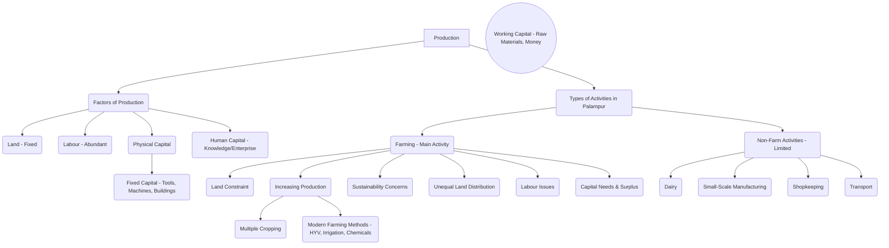

# Class 9 Social Studies - Economics Chapter 201
**Language:** English

```markdown
# [Class 9] Economics - Chapter 201: The Story of Village Palampur

## 🌟 Core Concepts

This chapter introduces fundamental concepts related to production, using the hypothetical village of Palampur as a case study.

**1. Production:**
    *   **Aim:** To produce goods and services required.
    *   **Organisation:** Combining factors of production.

**2. Factors of Production:**
    *   **Land:** Natural resources (land, water, forests, minerals). Fixed in supply for agriculture.
    *   **Labour:** Human effort (manual or skilled/educated). Abundant but often faces issues like low wages.
    *   **Physical Capital:** Inputs required during production.
        *   **Fixed Capital:** Reusable inputs (tools, machines, buildings). E.g., plough, tractor, tubewell, computer.
        *   **Working Capital:** Inputs used up in production (raw materials, money in hand). E.g., seeds, fertilisers, cash for payments.
    *   **Human Capital:** Knowledge and enterprise to combine other factors (introduced, detailed in the next chapter).

**3. Production Activities in Palampur:**
    *   **Farming Activities (Main Activity):**
        *   **Land Constraint:** Land area under cultivation is fixed (since 1960 in Palampur).
        *   **Increasing Production from Fixed Land:**
            *   **Multiple Cropping:** Growing more than one crop per year (e.g., Kharif - Jowar/Bajra; Potato; Rabi - Wheat; Sugarcane). Enabled by well-developed irrigation.
            *   **Modern Farming Methods:** Using High Yielding Variety (HYV) seeds, chemical fertilisers, pesticides, and assured irrigation (tubewells). Led to the Green Revolution.
        *   **Sustainability Issues:** Overuse of resources (soil fertility loss due to chemicals, groundwater depletion due to tubewells).
        *   **Land Distribution:** Highly unequal (few large farmers own most land, many small farmers, significant landless population).
        *   **Labour:** Provided by small farmers' families or hired farm labourers (often landless or from small farm families, facing low wages and competition).
        *   **Capital:** Significant requirement, especially for modern methods. Small farmers often borrow at high interest; large/medium farmers use savings.
        *   **Surplus:** Difference between production and consumption. Sold in the market (mainly by medium/large farmers). Earnings used for savings, next season's capital, or investment.
    *   **Non-Farm Activities (Limited Scale):** Activities other than agriculture.
        *   **Dairy:** Common activity; milk sold in nearby towns/villages.
        *   **Small-Scale Manufacturing:** Simple methods, often home-based (e.g., Mishrilal's jaggery production).
        *   **Shopkeeping:** Trading goods bought from wholesale markets (general stores, eatables).
        *   **Transport:** Rickshaws, tongas, jeeps, tractors, trucks, bullock carts ferry goods and people.

**📊 Concept Hierarchy:**



## 📘 Key Learnings

**1. Understanding Production:**
Production is the process of creating goods and services using a combination of resources called **factors of production**. The primary goal is to satisfy human wants. In Palampur, farming is the main production activity, supplemented by non-farm activities.

**2. The Four Factors of Production:**
*   **Land:** Includes the physical land surface and all natural resources like water and minerals. In farming, land is a fixed factor; its area cannot be easily increased. Palampur converted wastelands by 1960, leaving no scope for further expansion.
*   **Labour:** The human effort involved. It can be manual (farm labour) or mental (skilled professionals). Labour is abundant in villages like Palampur, leading to competition and low wages for farm labourers (like Dala getting ₹160 instead of the minimum ₹300/day).
*   **Physical Capital:** Man-made inputs.
    *   **Fixed Capital:** Assets used over many years (e.g., tractors, tubewells, buildings). Tejpal Singh plans to buy a tractor, increasing his fixed capital.
    *   **Working Capital:** Assets used up during production (e.g., HYV seeds, fertilisers, pesticides, cash). Modern farming requires more working capital than traditional methods. Savita needed ₹3,000 working capital for her 1-hectare plot.
*   **Human Capital:** The knowledge, skill, and enterprise required to organise land, labour, and physical capital to produce an output. This factor enables innovation and efficient management.

**Diagram: Factors of Production**
```mermaid
graph LR
    subgraph Factors of Production
        L[Land];
        LB[Labour];
        PC[Physical Capital];
        HC[Human Capital];
    end
    PC --> FC[Fixed Capital <br/>(Tools, Machines, Buildings)];
    PC --> WC[Working Capital <br/>(Raw Materials, Money)];
    L & LB & PC & HC --> P[Production Process] --> O[Output <br/>(Goods & Services)];
```

**3. Farming in Palampur: Methods and Challenges:**
*   **Intensification of Farming:** Since land is fixed, Palampur farmers increase production from the same land using:
    *   **Multiple Cropping:** Growing different crops in different seasons on the same land (e.g., Jowar/Bajra -> Potato -> Wheat). This is possible due to well-developed irrigation (electricity-run tubewells replaced Persian wheels).
    *   **Modern Farming Methods (Green Revolution):** Using HYV seeds, chemical fertilisers, pesticides, and extensive irrigation. This significantly increased yields (e.g., wheat yield rose from 1300 kg/ha to 3200 kg/ha in Palampur).
*   **Requirements & Consequences of Modern Farming:**
    *   Requires more cash (working capital) for inputs.
    *   Needs assured irrigation (tubewells).
    *   Environmental Impact: Loss of soil fertility due to chemical fertilisers, depletion of groundwater table, potential water pollution. Sustainability is a major concern.
*   **Unequal Land Distribution:** Land ownership is highly skewed. In Palampur, 150 out of 450 families are landless (mostly Dalits). 240 families cultivate small plots (< 2 ha), providing inadequate income. 60 medium/large farmer families cultivate > 2 ha, owning the majority of the land. This inequality mirrors the situation in many parts of India (Graph 1.1).
*   **Farm Labour:** Small farmers cultivate their own land. Medium/large farmers hire labourers, often paying less than minimum wage due to high competition for work (Dala and Ramkali's situation). Labourers lack rights over crops and face irregular employment.
*   **Capital Arrangement:** Small farmers (like Savita) often lack savings and must borrow from moneylenders or large farmers at very high interest rates (24% in Savita's case), sometimes under harsh conditions (working as labourer). Medium/large farmers (like Tejpal Singh) use their savings from selling surplus produce to fund the next season's capital needs or invest in fixed capital (like tractors).

**Diagram: Traditional vs. Modern Farming**
```mermaid
graph TD
    subgraph Traditional Farming
        T_Seeds[Traditional Seeds];
        T_Irrigation[Less Irrigation (Persian Wheel)];
        T_Fertiliser[Natural Manure (Cow Dung)];
        T_Capital[Lower Capital Need];
        T_Yield[Lower Yield];
    end
    subgraph Modern Farming (Green Revolution)
        M_Seeds[HYV Seeds];
        M_Irrigation[More Irrigation (Tubewells)];
        M_Fertiliser[Chemical Fertilisers & Pesticides];
        M_Capital[Higher Capital Need];
        M_Yield[Higher Yield];
    end
    M_Fertiliser --> Env_Impact[Environmental Concerns <br/>(Soil Degradation, Water Depletion)];
```

**4. Non-Farm Activities:**
These provide alternative employment but are limited in Palampur (only 25% of workers).
*   **Dairy:** Common, milk sold via collection centres.
*   **Small-Scale Manufacturing:** Simple, home-based production (e.g., Mishrilal's jaggery unit using a machine). Limited by capital and market access.
*   **Shopkeeping:** Retail trade in villages, selling goods procured from towns.
*   **Transport:** Growing sector due to better roads, connecting Palampur to Raiganj and Shahpur. Provides income for drivers/owners of various vehicles (e.g., Kishora using his buffalo cart).
*   **Potential for Growth:** Requires capital (loans at low interest are crucial), skills (like Kareem's computer centre), and market access (good roads, transport, communication).

## 🧩 Active Learning

**Activity: Research-based Case Study Analysis 🔍**

1.  **Case Study Focus:** Compare the economic situations of Savita (small farmer) and Tejpal Singh (large farmer) based on the chapter. Analyse:
    *   Land size and resources.
    *   Access to capital (savings vs. borrowing, interest rates).
    *   Farming methods used (inputs, technology).
    *   Production levels and generation of surplus.
    *   Ability to invest and improve economic condition.
    *   Dependence on other activities (farm labour for Savita).
2.  **Field Research (Optional, as suggested in NCERT):** Talk to two farmers in your own region (one small, one large/medium if possible). Gather information similar to the points above. Compare their situations with Savita and Tejpal Singh.
3.  **Report:** Write a brief report comparing the case studies (Palampur and local) focusing on how land size and access to capital influence farming practices and economic well-being. Evaluate the challenges faced by small farmers.

**Discussion: Critical Analysis of Real-World Impacts 🌍**

1.  **Sustainability of Green Revolution:** Discuss the long-term environmental consequences (soil health, water table) of modern farming methods as seen in Palampur and regions like Punjab. Is high yield sustainable? What alternative farming practices could be promoted? (Bloom's: Evaluating)
2.  **Land Inequality:** Analyse the impact of unequal land distribution (like in Palampur and India - Graph 1.1) on poverty, income disparity, and migration. Why do small plots often fail to provide adequate livelihood? What could be potential solutions? (Bloom's: Analysing/Evaluating)
3.  **Rural Labour & Migration:** Discuss the reasons behind low wages for farm labourers (like Dala and Ramkali) and the phenomenon of migration from villages (like Gosaipur and Majauli) to cities. What are the push and pull factors? What are the likely conditions faced by migrants? (Bloom's: Analysing)
4.  **Developing the Non-Farm Sector:** Evaluate the potential and challenges of expanding non-farm activities (like dairy, small manufacturing, services) in villages. What support (capital, infrastructure, markets, skills training) is needed to encourage diversification beyond farming? (Bloom's: Evaluating/Creating)

## 📝 Assessment Prep

**Case Studies & Diagrams 📝**

*   **Case Study 1 (Capital & Labour):** Analyse Mishrilal's jaggery production unit.
    *   Identify his fixed capital (sugarcane crushing machine) and working capital (sugarcane, money for electricity/payments).
    *   Who provides the labour? (Likely family labour).
    *   Why might his profit be small or why might he face a loss? (Scale, market access, input costs).
    *   Why does he sell in Shahpur? (Better market/prices than the village).
*   **Case Study 2 (Human Capital & Services):** Analyse Kareem's computer centre.
    *   What factors enabled him to start this non-farm activity? (Identifying need - students going to town, availability of skilled labour - women with degrees, availability of space).
    *   How is his capital and labour different from Mishrilal's? (Capital: Computers - fixed; Labour: Hired skilled employees).
*   **Diagram Analysis:**
    *   Explain the components of Physical Capital (Fixed vs. Working) using examples from Palampur's farming (tractor vs. seeds) or non-farm activities (jaggery machine vs. sugarcane).
    *   Interpret Graph 1.1 (Distribution of Cultivated Area and Farmers in India). What does it show about land inequality? How does this relate to Palampur's situation?
    *   Draw a simple flow chart showing how a large farmer like Tejpal Singh uses his surplus wheat production (consumption -> sale -> earnings -> savings -> capital for next season / investment). Contrast this with a small farmer like Savita who has little surplus.

## 🌏 Bharatiya Context

*   **Hypothetical Village, Real Basis:** Palampur is imaginary but based on research in a village in Bulandshahr district, Western Uttar Pradesh, making its characteristics (irrigation, cropping patterns) representative of the region.
*   **Green Revolution Impact:** The chapter highlights the success of the Green Revolution (late 1960s) in increasing wheat and rice production, particularly in **Punjab, Haryana, and Western Uttar Pradesh**, which were the first to adopt modern farming methods (HYV seeds, tubewells, chemicals, machinery). Table 1.2 shows the significant increase in wheat production post-1965-66. However, it also notes the environmental costs (soil degradation in Punjab) and the limited success for pulses initially.
*   **Irrigation Disparities:** Palampur's well-developed irrigation is contrasted with the national picture. While **riverine plains and coastal regions** are well-irrigated, areas like the **Deccan plateau** have low irrigation levels. Overall, less than 40% of India's cultivated area was irrigated (as per the text's context), making farming heavily rain-dependent in many areas. Table 1.1 shows the gradual increase in cultivated area under irrigation over the years.
*   **Land Distribution Inequality:** The unequal distribution of land in Palampur (80 upper caste families owning majority; 150 Dalit families landless; 240 families with small plots) reflects the broader Indian reality depicted in Graph 1.1, showing a large number of small farmers cultivating a small portion of the total land, while a small number of large farmers control a significant portion.
*   **Farm Labour Wages:** The issue of farm wages being below the government-set minimum wage (Dala getting ₹160 vs. ₹300/day in March 2019) due to high competition for work is a widespread problem in rural India.
*   **Rural Migration:** The example of migration from **Gosaipur and Majauli (North Bihar)** to Punjab, Haryana, Delhi, Mumbai etc., for work illustrates a common pattern driven by lack of local opportunities and poverty.
*   **Non-Farm Sector:** The statistic that only 24 out of 100 rural workers in India are engaged in non-farm activities highlights the continued dominance of agriculture and the need for diversification in rural employment.
*   **Data Sources:** The chapter uses data from official Indian sources like the Directorate of Economics and Statistics, Department of Agriculture, Cooperation and Farmers Welfare (Pocket Book of Agriculture Statistics).
```