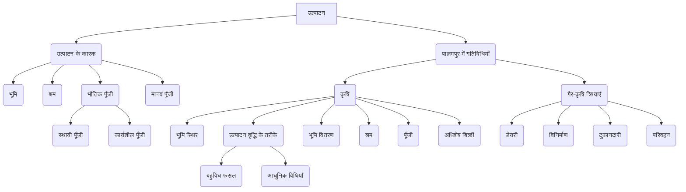

# Class 9 Social Studies - Economics Chapter 201
**Language:** हिंदी

```markdown
# कक्षा 9 अर्थशास्त्र - अध्याय 201: पालमपुर गाँव की कहानी

## 🌟 मुख्य अवधारणाएँ (Core Concepts)

**उत्पादन का संगठन (Organization of Production)**
*   **उद्देश्य:** वस्तुओं और सेवाओं का उत्पादन करना।
*   **उत्पादन के कारक (Factors of Production):**
    1.  **भूमि (Land):** प्राकृतिक संसाधन (जल, वन, खनिज सहित)। यह **स्थिर (Fixed)** है।
    2.  **श्रम (Labour):** काम करने वाले लोग (शारीरिक या मानसिक)। यह **प्रचुर (Abundant)** है।
    3.  **भौतिक पूँजी (Physical Capital):** उत्पादन के दौरान आवश्यक आगत।
        *   **स्थायी पूँजी (Fixed Capital):** औजार, मशीन, भवन (लंबे समय तक प्रयोग)।
        *   **कार्यशील पूँजी (Working Capital):** कच्चा माल, नकद पैसा (उत्पादन प्रक्रिया में समाप्त)।
    4.  **मानव पूँजी (Human Capital):** ज्ञान और उद्यम (अन्य कारकों को उत्पादन हेतु संयोजित करने की योग्यता)।

**पालमपुर में उत्पादन गतिविधियाँ (Production Activities in Palampur)**
*   **कृषि (Farming):** मुख्य गतिविधि (75% जनसंख्या निर्भर)।
    *   **भूमि वितरण (Land Distribution):** असमान (अधिकांश भूमि बड़े किसानों के पास, कई भूमिहीन)।
    *   **उत्पादन बढ़ाने के तरीके (Ways to Increase Production):**
        *   **बहुविध फसल प्रणाली (Multiple Cropping):** एक वर्ष में एक ही भूमि पर कई फसलें उगाना (जैसे खरीफ, रबी, जायद)।
        *   **आधुनिक कृषि विधियाँ (Modern Farming Methods):** HYV बीज, रासायनिक उर्वरक, कीटनाशक, सिंचाई (नलकूप), मशीनरी।
    *   **कृषि की स्थिरता (Sustainability of Farming):** आधुनिक विधियों से भूमि और जल संसाधनों पर दबाव।
*   **गैर-कृषि क्रियाएँ (Non-Farm Activities):** अन्य गतिविधियाँ (25% जनसंख्या)।
    *   डेयरी (Dairy)
    *   लघु-स्तरीय विनिर्माण (Small-Scale Manufacturing)
    *   दुकानदारी (Shopkeeping)
    *   परिवहन (Transport)

📊 **अवधारणा पदानुक्रम (Concept Hierarchy):**


## 📘 मुख्य सीख (Key Learnings)

1.  **पालमपुर का परिचय (Introduction to Palampur):**
    *   पालमपुर एक काल्पनिक गाँव है, जो रायगंज और शाहपुर जैसे पड़ोसी गाँवों और कस्बों से अच्छी तरह जुड़ा हुआ है।
    *   यहाँ विभिन्न जातियों के लगभग 450 परिवार रहते हैं, जिनमें भूमि का वितरण असमान है (80 उच्च जाति परिवारों के पास अधिकांश भूमि)।
    *   गाँव में सड़क, परिवहन, बिजली (सिंचाई और छोटे व्यवसायों के लिए), दो प्राथमिक विद्यालय, एक हाई स्कूल, एक सरकारी प्राथमिक स्वास्थ्य केंद्र और एक निजी औषधालय जैसी बुनियादी सुविधाएँ मौजूद हैं।
    *   मुख्य उत्पादन गतिविधि **कृषि** है, जबकि **गैर-कृषि क्रियाएँ** जैसे लघु विनिर्माण, डेयरी, परिवहन आदि सीमित पैमाने पर की जाती हैं।

2.  **उत्पादन के कारक (Factors of Production):**
    *   **भूमि:** कृषि उत्पादन का आधार, पालमपुर में कृषि भूमि 1960 से स्थिर है। प्राकृतिक संसाधन जैसे जल, वन, खनिज भी इसमें शामिल हैं।
    *   **श्रम:** खेती के लिए आवश्यक मेहनत। छोटे किसान स्वयं और परिवार के साथ श्रम करते हैं, जबकि मझोले और बड़े किसान **खेतिहर मजदूरों** (भूमिहीन या छोटे किसान) को काम पर रखते हैं। मजदूरी अक्सर कम होती है।
    *   **भौतिक पूँजी:**
        *   *स्थायी पूँजी:* ट्रैक्टर, हल, जनरेटर, कंप्यूटर, भवन आदि जिनका उपयोग कई वर्षों तक होता है।
        *   *कार्यशील पूँजी:* बीज, उर्वरक, कीटनाशक, कच्चा माल (जैसे कुम्हार के लिए मिट्टी) और नकद पैसा, जो उत्पादन प्रक्रिया में समाप्त हो जाते हैं।
    *   **मानव पूँजी:** उत्पादन के लिए भूमि, श्रम और पूँजी को एक साथ लाने के लिए ज्ञान और उद्यमशीलता की आवश्यकता।

3.  **पालमपुर में कृषि (Farming in Palampur):**
    *   **भूमि स्थिर है:** कृषि उत्पादन बढ़ाने में मुख्य बाधा यह है कि खेती के तहत भूमि क्षेत्र लगभग स्थिर है।
    *   **एक ही भूमि से अधिक उपज:**
        *   **बहुविध फसल प्रणाली:** एक वर्ष में एक ही भूमि पर एक से अधिक फसल उगाना। पालमपुर में किसान खरीफ (ज्वार, बाजरा), आलू (अक्टूबर-दिसंबर), और रबी (गेहूँ) उगाते हैं। गन्ना भी उगाया जाता है। यह विकसित **सिंचाई व्यवस्था** (बिजली चालित नलकूप) के कारण संभव हुआ।
        📈 **उदाहरण:** खरीफ (वर्षा ऋतु) -> आलू -> रबी (सर्दी)
        *   **आधुनिक कृषि विधियाँ:** **हरित क्रांति** (1960 के दशक के अंत में) ने किसानों को अधिक उपज वाले बीजों (HYV), रासायनिक उर्वरकों, कीटनाशकों और सिंचाई का उपयोग करके गेहूँ और चावल का उत्पादन बढ़ाना सिखाया। इससे उपज में काफी वृद्धि हुई (पालमपुर में गेहूँ की उपज 1300 किग्रा/हेक्टेयर से बढ़कर 3200 किग्रा/हेक्टेयर हो गई)।
        *   **आवश्यकताएँ:** आधुनिक विधियों के लिए अधिक पानी, रासायनिक आगत और **अधिक पूँजी (Working Capital)** की आवश्यकता होती है।
    *   **भूमि की धारणीयता (Land Sustainability):** आधुनिक कृषि विधियों ने प्राकृतिक संसाधनों का अत्यधिक उपयोग किया है। रासायनिक उर्वरकों के अधिक प्रयोग से **मिट्टी की उर्वरता कम** हुई है, और नलकूपों से **भूजल स्तर नीचे** गिरा है। भविष्य के कृषि विकास के लिए पर्यावरण की देखभाल आवश्यक है।
    *   **भूमि का वितरण:** पालमपुर में भूमि का वितरण **असमान** है। 150 परिवार भूमिहीन हैं, 240 परिवार छोटे किसान (<2 हेक्टेयर) हैं, और 60 परिवार मझोले व बड़े किसान (>2 हेक्टेयर) हैं। छोटे खेतों से पर्याप्त आय नहीं होती।
    *   **श्रम की उपलब्धता:** श्रम प्रचुर मात्रा में उपलब्ध है। खेतिहर मजदूरों को अक्सर सरकार द्वारा निर्धारित **न्यूनतम मजदूरी** से कम मजदूरी मिलती है (जैसे डाला को ₹300 के बजाय ₹160)। काम की कमी के कारण लोग पलायन भी करते हैं।
    *   **पूँजी की व्यवस्था:** आधुनिक खेती के लिए अधिक पूँजी चाहिए।
        *   *छोटे किसान:* अक्सर बड़े किसानों, साहूकारों या व्यापारियों से **ऊँची ब्याज दर पर ऋण** लेते हैं (जैसे सविता का तेजपाल सिंह से 24% ब्याज पर ऋण लेना)। ऋण चुकाना मुश्किल होता है।
        *   *मझोले और बड़े किसान:* अपनी **बचत** का उपयोग खेती के लिए पूँजी की व्यवस्था करने में करते हैं, जो उन्हें अधिशेष उपज बेचने से प्राप्त होती है।

4.  **अधिशेष कृषि उत्पादों की बिक्री (Sale of Surplus Farm Products):**
    *   किसान परिवार की खपत के लिए अनाज रखकर शेष **अधिशेष (Surplus)** को बाजार में बेचते हैं।
    *   छोटे किसानों के पास कम या कोई अधिशेष नहीं होता।
    *   मझोले और बड़े किसान (जैसे तेजपाल सिंह) अधिशेष बेचकर अच्छी कमाई करते हैं। इस कमाई का उपयोग वे अगली फसल के लिए कार्यशील पूँजी, स्थायी पूँजी (जैसे ट्रैक्टर खरीदना), बचत करने, या गैर-कृषि कार्यों में निवेश करने के लिए करते हैं।

5.  **पालमपुर में गैर-कृषि क्रियाएँ (Non-Farm Activities):**
    *   **डेयरी:** कई परिवारों के लिए आम गतिविधि। भैंस पालकर दूध पास के गाँव रायगंज में बेचा जाता है।
    *   **लघु-स्तरीय विनिर्माण:** छोटे पैमाने पर, सरल उत्पादन विधियों का उपयोग करके, अक्सर घर पर ही पारिवारिक श्रम की मदद से किया जाता है (जैसे मिश्रीलाल द्वारा गन्ने से गुड़ बनाना)।
    *   **दुकानदारी:** व्यापारी शहरों के थोक बाजारों से सामान खरीदकर गाँव में बेचते हैं (चावल, गेहूँ, चीनी, साबुन, आदि)।
    *   **परिवहन:** सड़क संपर्क अच्छा होने के कारण परिवहन एक उभरता हुआ क्षेत्र है। लोग रिक्शा, जीप, ट्रैक्टर, बैलगाड़ी आदि चलाकर माल और यात्रियों को एक स्थान से दूसरे स्थान तक पहुँचाते हैं (जैसे किशोरा ने बैंक ऋण से भैंस खरीदी, दूध बेचा और भैंसा-गाड़ी से परिवहन का काम भी किया)।

## 🧩 सक्रिय शिक्षण (Active Learning)

*   **गतिविधि (Activity):** शोध-आधारित केस स्टडी विश्लेषण 🔍
    *   अपने क्षेत्र के किसानों से बात करके उनकी कृषि विधियों (पारंपरिक/आधुनिक), सिंचाई के स्रोतों, और उन्हें आवश्यक आगत कहाँ से मिलते हैं, इस पर एक नोट लिखें।
    *   अपने क्षेत्र में कार्यरत दो खेतिहर मजदूरों या निर्माण श्रमिकों से उनकी मजदूरी, भुगतान का तरीका (नकद/वस्तु), काम की नियमितता और कर्ज की स्थिति के बारे में पता करें।
*   **चर्चा (Discussion):** वास्तविक दुनिया के प्रभावों का आलोचनात्मक विश्लेषण 🌍
    *   क्या बहुविध फसल प्रणाली और आधुनिक कृषि विधियों में अंतर है?
    *   क्या हरित क्रांति गेहूँ और दालों दोनों के लिए समान रूप से सफल रही? (तालिका 1.2 के आधार पर)
    *   आधुनिक कृषि विधियों से भूमि की उर्वरता और भूजल पर क्या प्रभाव पड़ रहा है? रासायनिक उर्वरकों के हानिकारक प्रभावों पर कृषि मंत्री को पत्र लिखें।
    *   पालमपुर में खेतिहर मजदूर गरीब क्यों हैं? लोग प्रवास क्यों करते हैं?
    *   छोटे किसानों के लिए ऋण प्राप्त करना क्यों कठिन है? यदि सविता को बैंक से कम ब्याज पर ऋण मिलता तो क्या उसकी स्थिति भिन्न होती?
    *   गाँवों में अधिक गैर-कृषि उत्पादन गतिविधियाँ कैसे शुरू की जा सकती हैं?

## 📝 मूल्यांकन तैयारी (Assessment Prep)

*   **केस स्टडी (Case Studies):**
    *   **सविता:** छोटी किसान, जिसे खेती के लिए पूँजी की आवश्यकता है और वह तेजपाल सिंह से महँगा ऋण लेती है। यह छोटे किसानों की ऋणग्रस्तता और कठिनाइयों को दर्शाता है।
    *   **डाला और रामकली:** भूमिहीन खेतिहर मजदूर, जिन्हें कम मजदूरी मिलती है और वे गरीब हैं। यह श्रम की अधिकता और कम मजदूरी की समस्या को दर्शाता है।
    *   **तेजपाल सिंह:** बड़ा किसान, जो अधिशेष गेहूँ बेचकर कमाई करता है और उस पैसे का उपयोग बचत, ऋण देने और पूँजीगत निवेश (ट्रैक्टर) के लिए करता है।
    *   **मिश्रीलाल:** लघु-स्तरीय विनिर्माण (गुड़ बनाना) का उदाहरण।
    *   **करीम:** कंप्यूटर सेंटर खोलकर गैर-कृषि सेवा क्षेत्र का उदाहरण।
    *   **किशोरा:** खेतिहर मजदूर जो बैंक ऋण से भैंस खरीदकर डेयरी और परिवहन जैसे विविध कार्यों से अपनी आय बढ़ाता है।
*   **आरेख और तालिकाएँ (Diagrams & Tables):**
    *   **तालिका 1.1:** वर्षों से भारत में खेती के तहत क्षेत्र।
    *   **तालिका 1.2:** हरित क्रांति के बाद गेहूँ और दालों का उत्पादन।
    *   **चित्र 1.5:** पालमपुर गाँव में कृषि भूमि का वितरण (असमानता दर्शाता है)।
    *   **ग्राफ 1.1:** भारत में किसानों और कृषि क्षेत्र का वितरण (छोटे किसानों की अधिक संख्या लेकिन कम भूमि)।

## 🌏 भारतीय संदर्भ (Bharatiya Context)

*   **सिंचाई (Irrigation):** पालमपुर में सिंचाई की अच्छी व्यवस्था है, लेकिन भारत में कुल कृषि क्षेत्र का **40% से भी कम** सिंचित है। पठारी क्षेत्रों (जैसे दक्कन का पठार) में सिंचाई का स्तर कम है। खेती काफी हद तक वर्षा पर निर्भर है।
*   **हरित क्रांति (Green Revolution):** भारत में 1960 के दशक के अंत में शुरू हुई। **पंजाब, हरियाणा और पश्चिमी उत्तर प्रदेश** के किसानों ने सबसे पहले आधुनिक कृषि विधियों को अपनाया, जिससे गेहूँ के उत्पादन में भारी वृद्धि हुई।
*   **भूमि वितरण (Land Distribution):** पालमपुर की तरह, भारत में भी भूमि का वितरण **अत्यधिक असमान** है। **लगभग 80% किसान छोटे किसान** हैं जिनके पास खेती के लिए बहुत कम भूमि है, जबकि बड़े किसानों की संख्या कम है लेकिन उनके पास अधिकांश भूमि है (ग्राफ 1.1)।
*   **न्यूनतम मजदूरी (Minimum Wages):** सरकार खेतिहर मजदूरों के लिए न्यूनतम मजदूरी तय करती है (जैसे मार्च 2019 में ₹300 प्रतिदिन), लेकिन पालमपुर जैसे कई गाँवों में मजदूरों को इससे **कम मजदूरी** मिलती है क्योंकि काम की तुलना में मजदूर अधिक हैं।
*   **ग्रामीण पलायन (Rural Migration):** काम की तलाश में गाँवों से शहरों की ओर पलायन भारत में आम है (जैसे बिहार के गोसाईपुर और मजौली गाँवों से पंजाब, हरियाणा, दिल्ली, मुंबई आदि में)।
*   **गैर-कृषि क्षेत्र (Non-Farm Sector):** वर्तमान में, भारत के ग्रामीण क्षेत्रों में **100 में से केवल 24 श्रमिक** गैर-कृषि कार्यों में लगे हैं। भविष्य में इसे बढ़ाने की आवश्यकता है, जिसके लिए पूँजी (कम ब्याज पर ऋण) और बाजार तक पहुँच आवश्यक है।
```