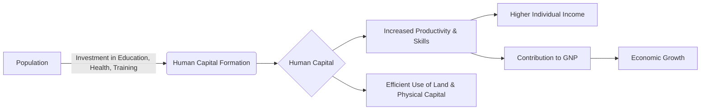

# Class 9 Social Studies - Economics Chapter 202
**Language:** English

```markdown
# [Class 9] Economics - Chapter 202: People as Resource

## 🌟 Core Concepts

This chapter introduces the concept of viewing a country's population not as a liability, but as a valuable **human resource**. Investment in this resource leads to **human capital formation**, enhancing national productivity and economic growth.

**📊 Concept Hierarchy:**

1.  **Population as a Resource:**
    *   **Human Resource:** The country's working people with existing productive skills and abilities. Contrasts with viewing population solely as a liability (requiring food, education, health facilities).
    *   **Human Capital:** The stock of skill, productive knowledge, and health embodied in people. Formed through investment.
        *   **Human Capital Formation:** The process of developing the existing human resource by investing in:
            *   **Education:** Acquiring knowledge and skills.
            *   **Health:** Ensuring physical and mental well-being for productivity.
            *   **Training:** Developing specific job-related skills.
        *   **Returns on Investment:** Yields higher productivity, higher incomes (like physical capital investment).
        *   **Superiority:** Human capital activates other resources (land, physical capital).
        *   **Cycles:**
            *   *Virtuous Cycle:* Educated/healthy parents invest more in their children's education/health.
            *   *Vicious Cycle:* Disadvantaged parents (uneducated, poor health/hygiene) may perpetuate similar conditions for their children.

2.  **Economic Activities:** Activities that add value to the national income.
    *   **Classification by Sector:**
        *   **Primary Sector:** Activities based on natural resources (Agriculture, Forestry, Fishing, Mining, Animal Husbandry, Poultry Farming, Quarrying).
        *   **Secondary Sector:** Manufacturing activities (transforming raw materials).
        *   **Tertiary Sector:** Service activities (Trade, Transport, Communication, Banking, Education, Health, Tourism, Insurance).
    *   **Classification by Purpose:**
        *   **Market Activities:** Performed for pay or profit (production of goods/services, government service).
        *   **Non-Market Activities:** Production for self-consumption (processing primary products, own-account production of fixed assets, domestic chores).
    *   **Gender Dimension:** Historical/cultural division of labour often assigns domestic, non-market (unpaid) work to women, which is not typically counted in National Income. Women entering the labour market (market activities) face wage disparities often linked to education and skill levels.

3.  **Quality of Population:** Determines the country's growth rate. Depends on:
    *   **Literacy Rate:** Ability to read and write; essential for accessing opportunities and exercising rights/duties.
    *   **Health:** Indicated by life expectancy, infant mortality rate (IMR); crucial for realising potential and productivity.
    *   **Skill Formation:** Acquired abilities relevant to economic activities.

4.  **Unemployment:** Situation where people willing to work at prevailing wages cannot find jobs. (Focuses on the workforce population: 15-59 years).
    *   **Types in India:**
        *   **Seasonal Unemployment:** Joblessness during certain months/seasons (common in agriculture).
        *   **Disguised Unemployment:** More people employed than necessary; removal of surplus labour doesn't reduce output (common in agriculture).
        *   **Educated Unemployment:** Joblessness among matriculates, graduates, and post-graduates (common in urban areas).
    *   **Consequences:** Wastage of human resource, economic overload, social unrest (hopelessness, despair), decline in health/education standards, indicator of a depressed economy.

## 📘 Key Learnings

**1. Population as an Asset (Human Capital):**
*   **Concept:** Instead of viewing a large population only as a burden needing resources, it can be seen as **human capital** – a stock of skills and productive knowledge.
*   **Formation:** Investment in **education, training, and medical care** transforms the population into human capital, similar to how investment creates physical capital (machines, buildings).
*   **Contribution:** Human capital contributes significantly to the **Gross National Product (GNP)** by enhancing productivity.
*   **Returns:** Investments in human capital yield returns through higher individual incomes (due to better skills/health) and societal gains (benefits spreading to others).
*   **Example (India):** The **Green Revolution** increased agricultural productivity through knowledge (improved technologies), and the **IT Revolution** highlights the primacy of human capital over material resources.
*   **Example (Global):** Countries like **Japan**, with limited natural resources, became developed by investing heavily in human capital (education, health), enabling efficient use of imported resources.

**2. The Role of Education and Health:**
*   **Education:**
    *   Enhances labour quality, leading to higher productivity and earnings (Story of Sakal).
    *   Opens new horizons, develops values, and contributes to societal growth, cultural richness, and governance efficiency.
    *   Educated parents tend to invest more in their children's education, creating a **virtuous cycle**.
*   **Health:**
    *   An indispensable basis for well-being, allowing individuals to realise their potential and fight illness.
    *   Healthy workers are more efficient and productive.
    *   Improved health status (lower IMR, higher life expectancy) indicates better quality of life and future progress.
    *   Lack of health access can trap individuals in low productivity and poverty (Story of Vilas), creating a **vicious cycle**.

**📈 Diagrammatic Representation (Conceptual):**



**3. Economic Activities & Gender Dimensions:**
*   Activities are broadly classified into **Primary** (resource extraction), **Secondary** (manufacturing), and **Tertiary** (services) sectors.
*   **Market activities** involve remuneration, while **non-market activities** are for self-consumption.
*   **Division of Labour:** Often, women perform unpaid domestic work (non-market activity, e.g., Sheela), which isn't counted in national income, while men engage in market activities (e.g., Buta). When women enter the labour market (e.g., Geeta), their earnings depend on education and skill, often facing lower pay and less job security compared to men unless highly educated/skilled.

**4. Understanding Unemployment in India:**
*   Unemployment represents a **wastage of human resources**, turning potential assets into liabilities.
*   **Rural Areas:** Prone to **seasonal** (off-season in agriculture) and **disguised** unemployment (more workers than needed on family farms).
*   **Urban Areas:** Characterized by **educated unemployment**, where qualified individuals struggle to find jobs matching their skills, indicating a mismatch between the education system's output and market demands.
*   **Impact:** Leads to economic hardship, social problems, and hinders overall economic growth.

## 🧩 Active Learning

**1. Activity: Research-Based Case Study Analysis 🔍**
*   **Task:** Following the model of Sakal and Vilas, visit a nearby village or slum area (or conduct interviews if a visit isn't possible). Identify a young person (around Class 9 age) and create a case study focusing on:
    *   Their educational background and aspirations.
    *   Their health status and access to healthcare.
    *   Their family's economic activities (sector, market/non-market).
    *   Any skills they possess or are acquiring.
    *   Opportunities and challenges they face.
*   **Analysis:** Compare your case study with Sakal and Vilas. Evaluate how factors like education, health, and family background are influencing their potential to become a productive resource.

**2. Discussion: Critical Analysis of Real-World Impacts 🌍**
*   **Prompt 1 (Education & Employment):** Analyze Graph 2.1 (Literacy Rates). Discuss the trends, gender and regional disparities (Kerala vs. Bihar). Critically evaluate the effectiveness of schemes like *Sarva Shiksha Abhiyan* and *Mid-day Meal* in improving not just enrolment but also the quality of education and reducing dropout rates. How can the education system be modified to better address educated unemployment? Suggest concrete measures (Bloom's: Evaluating/Creating).
*   **Prompt 2 (Health Infrastructure):** Examine Table 2.2 (Health Infrastructure). Discuss the growth in facilities and personnel. Is this growth adequate considering India's population? Evaluate the accessibility and quality of healthcare, especially for underprivileged sections. What further steps should national health policy prioritize? (Bloom's: Evaluating).
*   **Prompt 3 (Economic Activities & Gender):** Reflect on the distinction between market and non-market activities. Critically analyze the economic implications of unpaid domestic work predominantly done by women. Should this work be included in National Income calculations? Debate the pros and cons. Evaluate the factors contributing to lower pay for women in the organised and unorganised sectors. (Bloom's: Evaluating).
*   **Prompt 4 (Human Capital Development):** Analyze the 'Story of a Village'. Identify the sequence of human capital investments (agro-engineer, teacher, tailor) and evaluate how each contributed to the village's economic transformation and creation of new job opportunities. Can this model be replicated? What are the essential prerequisites? (Bloom's: Analyzing/Evaluating).

## 📝 Assessment Prep

*   **Case Study Analysis:** Be prepared to analyze scenarios similar to Sakal and Vilas or the 'Story of a Village'.
    *   Identify the investments (or lack thereof) in human capital (education, health).
    *   Explain the consequences of these investments on individual lives and the economy.
    *   Compare and contrast different situations, evaluating the factors leading to virtuous or vicious cycles.
    *   *(Example Q: Compare the life trajectories of Sakal and Vilas, evaluating the role of education and health in their economic outcomes.)*
*   **Data Interpretation & Evaluation:** Practice interpreting data presented in tables and graphs (like Literacy Rates - Graph 2.1, Education Institutions - Table 2.1, Health Infrastructure - Table 2.2).
    *   Identify trends, calculate percentage changes, and compare data points.
    *   Critically evaluate the adequacy and implications of the data presented (e.g., Is the increase in colleges sufficient? Does the health data reflect equitable access?).
    *   Relate the data to concepts like quality of population, human capital formation, and development challenges.
    *   *(Example Q: Based on Table 2.2, evaluate the progress in India's health infrastructure between 1951 (implied starting point for comparison) and 2021. Is the increase in doctors adequate? Justify your answer.)*
*   **Concept Application:** Apply concepts like types of unemployment (seasonal, disguised, educated) and sectors of the economy (primary, secondary, tertiary) to real-world or hypothetical examples.
    *   *(Example Q: A family of 8 works on a small farm plot that only requires 5 people for optimal cultivation. Identify the type of unemployment present and explain its implications.)*

## 🌏 Bharatiya Context

This chapter heavily utilizes Indian data and examples to illustrate economic concepts:

*   **Demographics & Policy:** Views India's large population as a potential asset if investments in human capital are made. Refers to National Policies on Education (NEP 1986 mentioned) and Health aiming to improve quality and accessibility.
*   **Economic Examples:**
    *   **Green Revolution:** Cited as a prime example of how knowledge and technology (human capital inputs) boosted productivity on scarce land resources.
    *   **IT Revolution:** Used to illustrate the growing importance of human capital relative to physical capital in modern economies.
*   **Education Data & Initiatives:**
    *   **Literacy Rates:** Trends from 1951 (18%) to 2018 (85%), highlighting significant progress but also persistent disparities: Male (16.1% higher than female), Urban (14.2% higher than rural), Regional (Kerala ~94% vs. Bihar ~62% in 2011).
    *   **Government Schemes:** Mentions *Sarva Shiksha Abhiyan* (universal elementary education), *Mid-day Meal Scheme* (nutrition and retention), establishment of *Navodaya Vidyalayas*.
    *   **Higher Education:** Data on the growth of colleges, universities, enrolment (GER ~27% in 2019-20), and faculty (Table 2.1). Expenditure on education as % of GDP (~3%).
*   **Health Data & Infrastructure:**
    *   **Improvements:** Life expectancy increased to over 67.2 years (2021). Infant Mortality Rate (IMR) decreased significantly from 147 (1951) to 28 (2020). Crude birth and death rates have also dropped.
    *   **Infrastructure Growth:** Data presented on the increase in Sub-centres, PHCs, CHCs, dispensaries, hospital beds, doctors, and nursing personnel over the years (Table 2.2).
    *   **Regional Disparities:** Notes that basic facilities are lacking in many parts of India, and states like Andhra Pradesh, Karnataka, Maharashtra, and Tamil Nadu have a disproportionately high number of medical colleges.
*   **Employment Scenario:**
    *   **Unemployment Types:** Discusses the prevalence of **seasonal** and **disguised unemployment** in rural agriculture, and **educated unemployment** in urban areas as specific challenges for India.
    *   **Sectoral Employment:** Agriculture remains the largest labour-absorbing sector, but disguised unemployment is pushing surplus labour towards secondary and tertiary sectors.
    *   **Informal Nature:** Highlights that many employed individuals in India work with low income and productivity, often in self-employment (especially primary sector), masking the true extent of underemployment.
*   **Social Context:** Acknowledges the historical and cultural basis for the division of labour between men and women, and the economic non-recognition of women's domestic work (Sheela's example). Discusses lower pay and job insecurity often faced by women in the labour market.

```